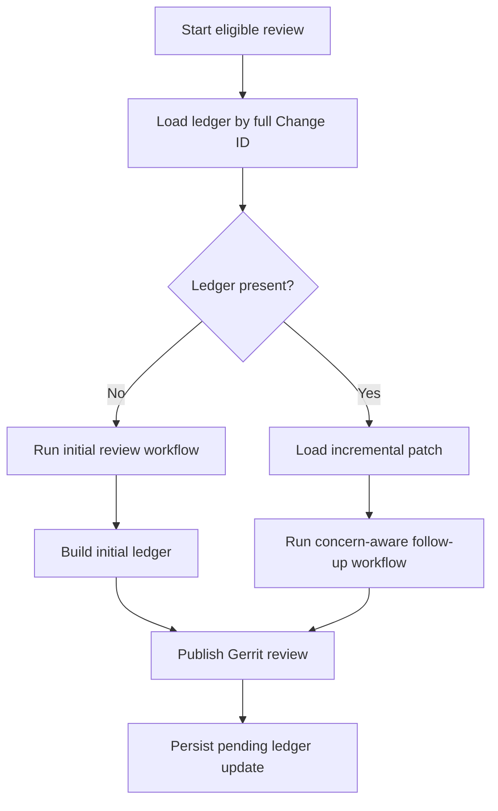
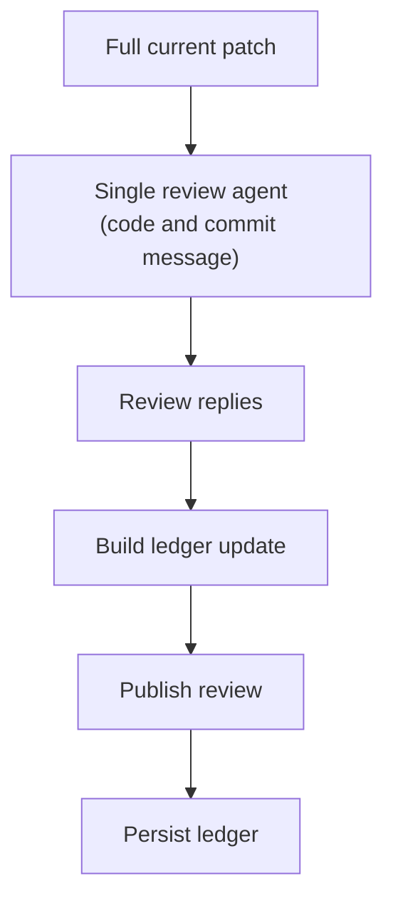
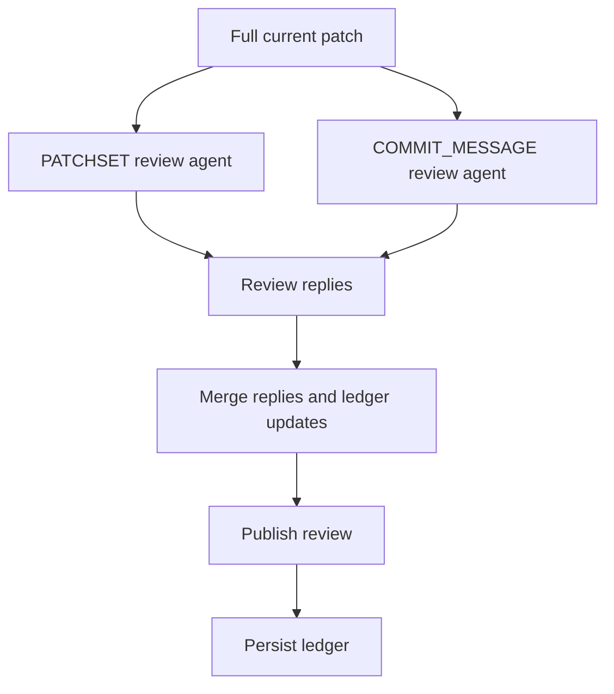
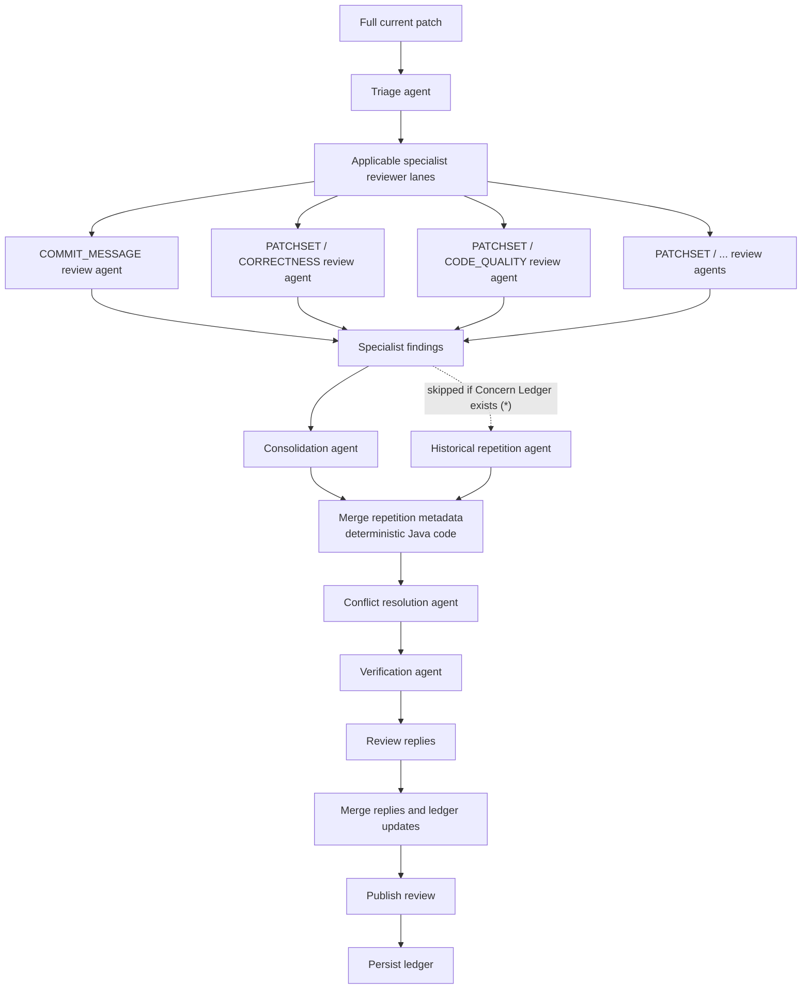
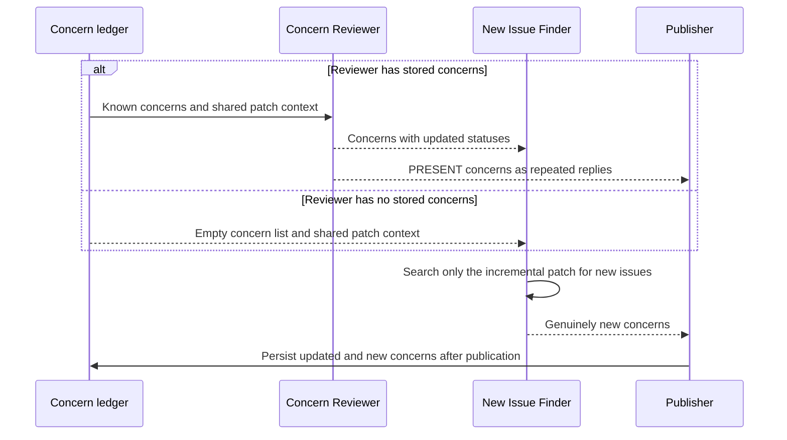
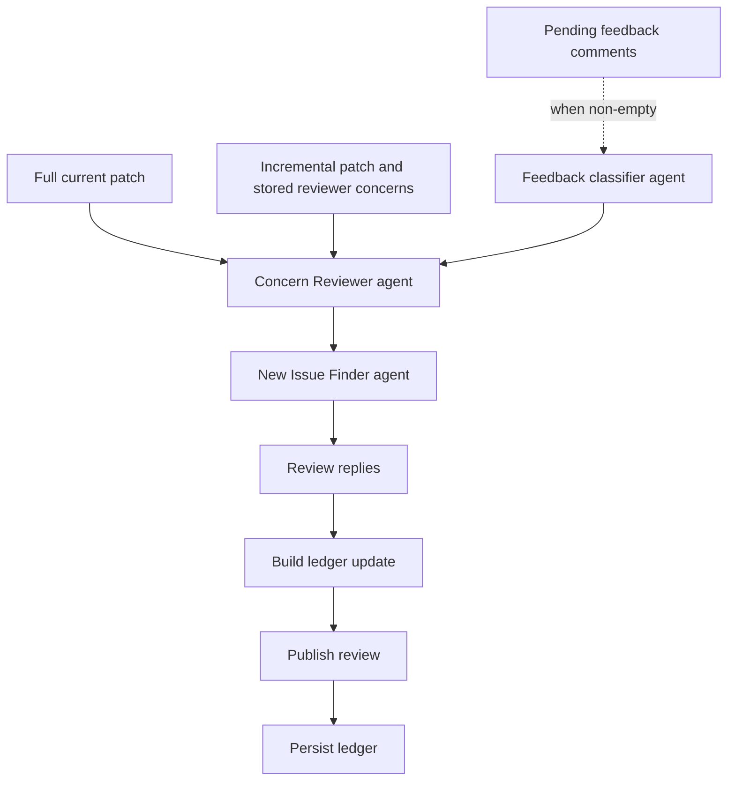
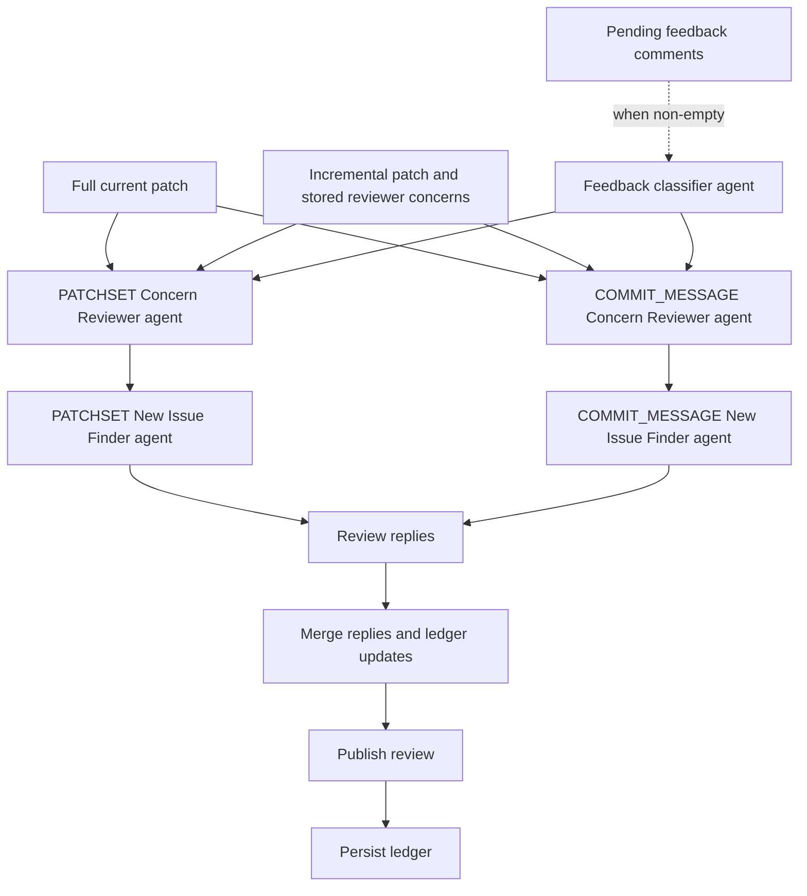
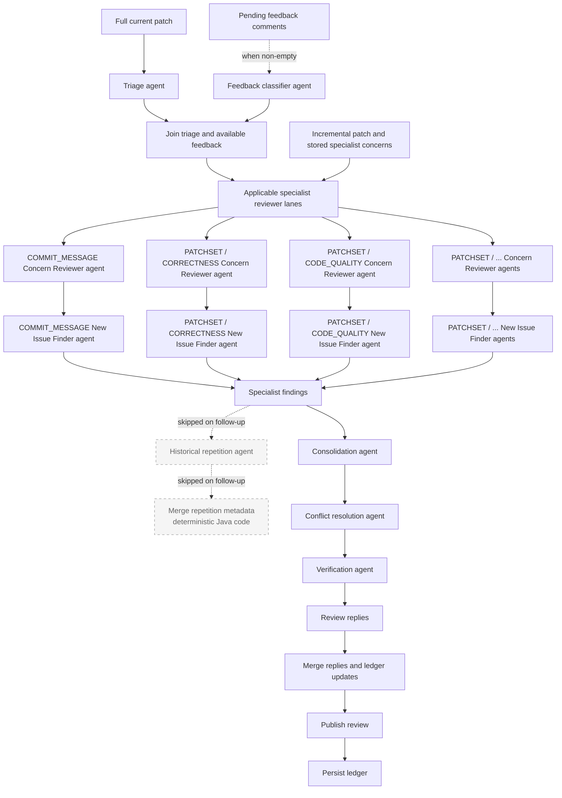

# Review Agent Architecture

ReviewAI separates the review of known concerns from the discovery of new issues and distills user feedback into
durable review guidance. This document describes those workflows, the agent-specialization levels, the concern
lifecycle, and the persistence rules that connect reviews of successive Patch Sets.

For configuration values, see [Configuration](configuration.md). For commands such as `/review` and
`/forget_thread`, see the [Command Reference](commands.md).

## Core Concepts

### Concern

A concern is a review finding with a stable ID and lifecycle state. It retains the information needed to reassess and
republish the finding, including its description, reviewer ownership, locations, status reason, original reply, score,
and repetition metadata.

New concerns start as `PRESENT`. On later reviews, the Concern Reviewer assigns one of these states:

| Status | Meaning |
| --- | --- |
| `PRESENT` | Current code still demonstrates the concern. |
| `FIXED` | Current code demonstrates that the concern has been resolved. |
| `UNCERTAIN` | Available evidence is insufficient to prove either `PRESENT` or `FIXED`. |
| `DISMISSED` | A user explicitly declared the concern non-actionable under a recorded rationale. |

No state is terminal. In particular, a `FIXED` concern is reassessed and can return to `PRESENT` after a regression. A
`DISMISSED` concern remains suppressed while its rationale applies, but it can return to `PRESENT` after explicit user
feedback reopens it or concrete later code or specification evidence invalidates that rationale. Only a user-feedback
workflow may newly assign `DISMISSED`; the Concern Reviewer cannot invent a dismissal.

`ReviewConcern` is the canonical lifecycle structure and is also used by the specialized-agent finding pipeline.
`AiReplyItem` remains the publication-facing structure expected by the existing Gerrit review path.
`ReviewConcernReplyMapper` handles this boundary for the single and scoped workflows and when publishing repeated
concerns; Level 2 maps verified collector findings to concerns while retaining their specialist ownership. This keeps
lifecycle state centralized without requiring the Gerrit output API to become the persistence model.

### Logical reviewer

A reviewer identifies a review responsibility, not an AI provider or model. OpenAI, Gemini, DeepSeek, MoonShot, and
Ollama are model providers; they are not concern reviewers.

A reviewer ID contains a kind and name:

| Specialization level | Reviewer kind | Reviewer names |
| --- | --- | --- |
| `SINGLE_AGENT` | `SINGLE_AGENT` | `PATCHSET` |
| `SCOPED_AGENTS` | `SCOPED_AGENT` | `PATCHSET`, `COMMIT_MESSAGE` |
| `SPECIALIZED_AGENTS` | `SPECIALIZED_AGENT` | `COMMIT_MESSAGE`, `CORRECTNESS`, `TESTABILITY`, `CODE_QUALITY`, `DOCUMENTATION`, `SECURITY` |

Each reviewer owns a separate list of concerns. This prevents a correctness agent, for example, from silently changing
the state of a concern owned by the security agent.

### Concern ledger

The concern ledger is ReviewAI's persisted record of the concerns currently tracked for one Gerrit Change. It groups
concerns by logical reviewer and preserves each concern's identity, status, location, and publication data across
successive Patch Sets. A ledger can exist even when it contains no concerns.

### Review feedback memory

Review feedback memory is the persisted, change-scoped summary of durable user guidance. It contains:

- `generic_feedback`: recommendations that apply across the Patch Set, such as review scope or testing expectations.
- `concern_feedback`: summaries keyed by exact concern ID, such as an accepted risk, intentional constraint, or
  dismissal rationale for one known concern.

The memory stores distilled guidance rather than raw conversations. Questions, acknowledgements, and other
non-durable messages are not included. Generic guidance is supplied to later review agents, while concern-specific
guidance is authoritative only for the concern with the matching ID.

### Change and Patch Set

The concern ledger belongs to a Gerrit Change, not to an individual Patch Set. All Patch Sets of the same Change
therefore update the same ledger, while every other Change has a separate ledger.

The workflow uses two representations of the code update:

- The **full patch** is the formatted current Patch Set supplied to the normal review workflow.
- The **incremental patch** is the diff between the ledger's last successfully reviewed commit and the current Patch
  Set. Legacy ledger rows without that checkpoint fall back to the immediately previous Patch Set.

The incremental patch is loaded only when a ledger already exists. A missing ledger selects the initial-review path.

## Review Selection

At the start of an eligible review, ReviewAI loads the ledger for the Change. Ledger presence selects the workflow:



An empty ledger is still a present ledger. Once a ledger row exists, the next eligible review uses the follow-up path
even if the ledger contains no concerns.

This selection is not currently guarded by commit SHA. Concern-aware stages run on every eligible review for which a
ledger exists, even if the current SHA is unchanged.

Ordinary conversational comment events do not use the concern workflow unless they force a review. Suggestion mode
also follows its dedicated workflow rather than creating or updating the concern ledger.

## User Feedback Classification

When a user posts a comment addressed to ReviewAI, the comment collector records the addressed comment IDs in a
change-scoped journal before parsing commands. A reply to an unresolved AI comment counts as addressed even without an
explicit mention. The ordinary comment workflow then answers the user without running the feedback classifier.

On the next eligible review, ReviewAI claims all pending IDs and loads the complete comment history. The classifier
receives each claimed user comment as an exact target, with its preceding thread supplied separately as context. This
prevents an older conversational exchange in the same thread from obscuring guidance in the newest message.

The feedback classifier assigns every substantive addressed comment to exactly one category:

| Category | Meaning | Memory update |
| --- | --- | --- |
| `GENERIC` | Durable guidance that applies across the Patch Set. | Merge into `generic_feedback`. |
| `CONCERN` | Durable evidence or a decision about exactly one known concern. | Merge under that concern's exact ID. |
| `IRRELEVANT` | A question, acknowledgement, or other non-guidance conversation. | None. |

Commands and a leading AI mention are removed when checking whether a target comment has substantive content. If no
substantive target comments remain, the classifier returns the current memory without making an AI request.

For a reply in an AI concern thread, ReviewAI walks the exact `inReplyTo` lineage and compares ancestor Gerrit comment
IDs with the comment ID persisted on each ledger concern. That match becomes a strong concern-routing hint; text or
code location similarity is not used to infer the concern.

When pending comments exist, execution order depends on the specialization level:

| Level | Ordinary comment event | Patch Set or full forced review |
| --- | --- | --- |
| `SINGLE_AGENT` | Enqueue and answer; do not classify. | Classify before the concern or initial-review workflow. |
| `SCOPED_AGENTS` | Enqueue, route, and answer; do not classify. | Classify once before scoped-agent fan-out. |
| `SPECIALIZED_AGENTS` | Enqueue and answer; neither classifier nor triage runs. | Start classification and triage concurrently, join both, then invoke specialists. |

A forced review restricted to one stage classifies before invoking that selected stage instead of running specialized
triage. If there are no pending comments, every level skips the classifier entirely and retains the current memory.

The journal uses `PENDING`, `PROCESSING`, and `PROCESSED` states. Its `(change_id, comment_id)` key makes repeated Gerrit
delivery idempotent, and processed rows remain as tombstones so the same user message is not classified again. After
a successful AI response and Gerrit publication, ReviewAI atomically saves the updated memory and marks the claim
processed. AI or publication failures release the claim back to `PENDING` for a later review.

## Agent-Specialization Levels

The `agentSpecializationLevel` setting determines how review responsibilities are divided.

| Level | Initial review | Concern ownership |
| --- | --- | --- |
| `SINGLE_AGENT` | One agent reviews code and commit message together. | One `PATCHSET` reviewer owns the combined findings. |
| `SCOPED_AGENTS` | Patch Set and Commit Message agents run as separate scopes. | `PATCHSET` and `COMMIT_MESSAGE` own separate lists. |
| `SPECIALIZED_AGENTS` | Triage selects specialized agents, whose findings pass through a collector pipeline. | Each selected specialist owns its own concerns. |

At `SCOPED_AGENTS`, the Patch Set and Commit Message scopes can execute concurrently. Within one scope, the
Concern Reviewer and New Issue Finder execute serially. At `SPECIALIZED_AGENTS`, selected specialists can execute
concurrently, but the two concern stages remain serial for each specialist.

In the diagrams, a label such as `PATCHSET / CORRECTNESS` combines the review scope and reviewer name for readability.
The stored reviewer name remains `CORRECTNESS`; `PATCHSET /` is not part of its identity.

## Initial Review

When no ledger exists, ReviewAI preserves the original review behavior for the configured specialization level.

### Single agent

One request reviews the Patch Set and commit message. Every non-empty reply becomes a concern owned by the
`SINGLE_AGENT/PATCHSET` reviewer.



### Scoped agents

The Patch Set and Commit Message agents review their scopes independently. Their replies become concerns owned by
`SCOPED_AGENT/PATCHSET` and `SCOPED_AGENT/COMMIT_MESSAGE`, respectively. The results are merged into one ledger.



### Specialized agents

The specialized workflow performs these steps:



**(*) Backward compatibility:** this agent recovers eligible historical Gerrit concerns that predate concern-ledger
support or are otherwise missing from the ledger. It is not used once a ledger exists.

Triage selects from the commit-message, correctness, testability, code-quality, documentation, and security agents,
subject to review scope and configuration. Selected specialists execute concurrently. Consolidation and historical
repetition matching also start independently before their results are merged.

Historical repetition matching is retained on this path for backward compatibility because no concern ledger exists
yet. It compares current findings with eligible historical Gerrit comments and can mark a finding as repeated.

Only verified findings that can be associated with their source specialist are stored in the Level 2 ledger. An
association failure is logged and leaves that finding out of the ledger.

## Follow-Up Review

When a ledger exists, every applicable logical reviewer follows the same two-stage contract. The sequence below shows
one reviewer lane; the level-specific diagrams later in this document show how those lanes execute together.



The Concern Reviewer is skipped when the applicable reviewer has no stored concerns. The New Issue Finder still runs,
because the latest incremental patch can introduce the reviewer's first concern.

### Stage 1: Concern Reviewer

The Concern Reviewer receives every stored concern owned by that reviewer. It must:

1. Return exactly one status update for every supplied concern.
2. Preserve every concern ID.
3. Reassess concerns in all prior states, including `FIXED` and `DISMISSED` concerns.
4. Update only `status` and `status_reason`.
5. Avoid searching for or reporting new concerns.

A response with missing, additional, duplicate, or blank concern IDs is rejected. The same is true when an update omits
its status. This prevents a malformed model response from silently dropping known concerns.

### Stage 2: New Issue Finder

The New Issue Finder receives the updated concern list as its source of truth. It must:

1. Search only for issues introduced by `incremental_patch`.
2. Avoid reporting or rephrasing any known concern, regardless of status.
3. Use `full_patch` only as supporting context when it is present.
4. Avoid broadening its review to unchanged code.

For single and scoped agents, the plugin assigns a new stable ID when a returned concern has no ID, has a blank ID, or
reuses an existing ID. The specialized workflow derives stable ledger IDs while associating verified findings with
their source specialists. In every workflow, repetition metadata is cleared from new findings so the New Issue Finder
cannot classify its own output as historical.

### Shared patch context

Both concern stages use the same `ConcernWorkflowInput` structure:

```json
{
  "concerns": {
    "reviewer": {
      "kind": "SPECIALIZED_AGENT",
      "name": "CORRECTNESS"
    },
    "concerns": []
  },
  "incremental_patch": "...",
  "full_patch": "...",
  "review_feedback": {
    "schema_version": 1,
    "generic_feedback": "Prefer focused tests of observable behavior.",
    "concern_feedback": {
      "concern-id": "This fallback is intentional for legacy callers."
    }
  }
}
```

Patch selection is centralized so the stages cannot diverge:

| `codeContextPolicy` | `incremental_patch` | `full_patch` | Additional repository context |
| --- | --- | --- | --- |
| `NONE` | Included | Included | No context tools |
| `ON_DEMAND` | Included | Omitted | Model can list, search, and read repository files through tools |

The full patch does not change the New Issue Finder's scope. It provides context for interpreting changes in the
incremental patch. `review_feedback` supplies generic guidance and exact per-concern context; it does not broaden the
review scope or authorize a concern to consume feedback belonging to another concern ID.

## Concern Lifecycle Example

Assume the correctness reviewer discovers a null dereference in Patch Set 1.

| Patch Set | Concern Reviewer result | New Issue Finder result | Published result | Ledger after review |
| --- | --- | --- | --- | --- |
| 1 | Not run because no ledger exists. | Original review workflow runs instead. | New comment for concern A. | A is `PRESENT`. |
| 2 | A becomes `FIXED`. | Finds new concern B. | New comment for B; A is not repeated. | A is `FIXED`; B is `PRESENT`. |
| 3 | A remains `FIXED`; B remains `PRESENT`. | Finds nothing new. | B is referenced as repeated. | A is `FIXED`; B is `PRESENT`. |
| 4 | A regresses to `PRESENT`; B becomes `FIXED`. | Finds new concern C. | A is referenced as repeated; new comment for C. | A is `PRESENT`; B is `FIXED`; C is `PRESENT`. |

Fixed concerns remain in the ledger so regressions can be detected and so the New Issue Finder knows that the issue is
already known.

## Repeated Comments

The `repeated` field remains supported as publication metadata. Its source depends on the workflow:

- On an initial Level 2 review, historical Gerrit-comment matching can set `repeated=true`.
- On a follow-up review, each ledger concern confirmed as `PRESENT` is converted to a repeated reply.
- New Issue Finder results are forced to non-repeated findings.

With reply filtering enabled, a repeated reply is not posted as a new inline comment. Instead, it contributes to the
review's repeated-comments message, which references the earlier concern.

### Level 2 follow-up behavior

Level 2 follow-ups skip the historical repetition stage and use the ledger as the sole source of known repeated
concerns. Consolidation, conflict resolution, and verification continue to run. Repetition metadata is cleared before
and after the remaining collector stages so those agents cannot reintroduce it for a new finding.

This design relies on the normal invariant that every successfully published AI concern is represented in the ledger.
A completely absent ledger is handled safely by the initial path, which still runs historical matching. The narrower
edge case is an existing but incomplete ledger—for example, a Level 2 reply that could not be associated with its
source specialist or concerns created under a substantially different reviewer configuration. Historical matching is
not used to recover such omissions once a ledger exists.

## Follow-Up Pipelines by Specialization Level

On a follow-up, each original review-agent lane is split into a Concern Reviewer and a New Issue Finder for the same
logical reviewer. The two requests execute serially within that lane. Triage and collector stages are orchestration
stages, not review-agent lanes, so they are not split.

In every diagram below, a Concern Reviewer request is skipped when its reviewer has no stored concerns; the unchanged
empty list passes directly to the New Issue Finder.

`Full current patch` denotes the workflow input. Whether it is included in an individual concern-stage request follows
the `codeContextPolicy` rules in [Shared patch context](#shared-patch-context). The arrow from a Concern Reviewer to its
New Issue Finder represents both the updated concerns and that shared patch context.

For clarity, these level diagrams omit the deterministic conversion of `PRESENT` concerns into repeated replies.
Those replies bypass the New Issue Finder and, for Level 2, the collector pipeline; they are merged back before
publication. See [Repeated Comments](#repeated-comments) for the publication behavior.

### Single agent



### Scoped agents

The two reviewer lanes can execute concurrently, while each lane preserves Concern Reviewer before New Issue Finder.



### Specialized agents

For Level 2, triage still runs on every eligible follow-up. It selects agents relevant to the current update. ReviewAI
also adds any in-scope specialist that owns stored concerns, even when triage did not select it, so its concerns can be
reassessed.



Different specialist lanes can execute concurrently. Only New Issue Finder output enters the follow-up collector.
Confirmed `PRESENT` concerns bypass the collector and become repeated replies. Unlike the initial pipeline, the
follow-up collector does not run Historical Repetition or the deterministic repetition merge.

## Persistence and Publication

Concern data is stored in the plugin's H2-compatible database schema:

| Table | Purpose |
| --- | --- |
| `review_concern_ledgers` | One schema-versioned ledger row and last-reviewed commit checkpoint per full Change ID. |
| `review_concern_reviewers` | Ordered logical reviewers belonging to a ledger. |
| `review_concerns` | Ordered, status-indexed concerns belonging to a reviewer. |
| `review_feedback_memories` | One schema-versioned generic and per-concern feedback summary per full Change ID. |
| `review_feedback_comments` | Replay-safe processing state for each addressed user comment ID. |

The complete concern is serialized in `concern_json`, while identity, order, and status are also stored in dedicated
columns. Saving a ledger replaces its reviewer and concern rows in one transaction.

Agent clients attach ledger changes to the AI response as pending updates and place classified feedback memory on the
review context. `PatchSetReviewer` first publishes the Gerrit review, then persists ledger updates and completes the
feedback claim. Completing a claim saves its memory and processed states in one transaction. An AI request failure or
review-publication failure releases the feedback claim and does not advance its memory.

The database distinguishes these states:

- **No ledger row:** use the initial-review path.
- **Ledger row with no reviewers or concerns:** use the follow-up path.
- **Ledger row with concerns:** reassess those concerns and search for new issues.

A Change may have no ledger when it predates concern tracking, has not completed an eligible review, encountered a
review failure, or was cleared. Invalid or unsupported ledger data is also ignored and therefore selects the initial
path on the next eligible review.

### Forgetting a thread

`/forget_thread` clears the conversation context, concern ledger, and review feedback memory for the Change. It also
marks any pending or in-progress feedback rows processed while preserving comment-ID tombstones. The next eligible
review therefore behaves like an initial ledger-backed review and can rebuild the ledger from its result.

## Scope and Operational Considerations

- A follow-up review uses more model requests than an initial single-agent review. Each applicable reviewer can require
  a Concern Reviewer request and a New Issue Finder request.
- The Concern Reviewer request is skipped for reviewers with no stored concerns.
- Scoped reviewers and specialized reviewers can execute concurrently, subject to `aiMaxConcurrentRequests`.
- Changing `agentSpecializationLevel` changes reviewer identities. Existing concerns owned by another reviewer kind
  remain in the ledger but are not automatically reassigned.
- Topic, suggestion, and conversational workflows have separate orchestration and are outside the concern lifecycle
  described in this document.
- User annotations are not part of the concern status lifecycle described here.
