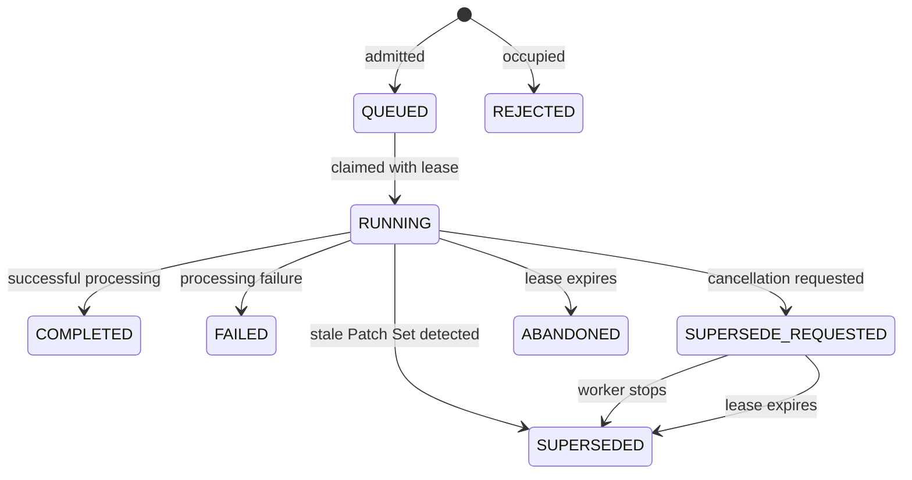

# AI Request Coordination

ReviewAI persists eligible Gerrit events as durable AI requests and coordinates their execution per Gerrit Change.
This layer prevents overlapping work from publishing stale or conflicting results, while still allowing independent
Changes and internal review agents to run concurrently.

This document describes request intake, persistence, serialization, recovery, supersession, and retention. For the
agent workflows that execute inside one accepted review, see [Review Agent Architecture](review-agents.md). For the
settings mentioned here, see [Configuration](../configuration.md).

## Design Goals and Invariants

The coordinator maintains these invariants:

- At most one durable AI request is active for a Change.
- Requests for different Changes may execute concurrently.
- Ordinary messages are processed in arrival order for their Change.
- Review and suggestion requests are rejected while their Change is occupied instead of waiting behind earlier work.
- Replayed Gerrit events do not create duplicate requests.
- Queued work survives plugin restart and can be reconstructed without the original Java event object.
- Only the worker that owns a request may renew its lease or complete it.
- Closing a Change cancels its active review and removes its durable request state.

The database is the source of truth for durable state. In-memory maps avoid redundant work within one plugin process,
but correctness does not depend on them alone.

## Intake and Admission

`EventHandlerExecutor` performs enough preprocessing to determine whether an event requires durable AI work. The
result has one of three dispositions:

| Disposition | Behavior |
| --- | --- |
| `IGNORE` | Stop processing because the event does not require plugin action. |
| `DIRECT` | Execute immediately without entering the durable queue. This is used for commands that do not require an AI request. |
| `PERSIST` | Serialize the event, admit a durable request, and schedule its Change for processing. |

Persistent requests use the following admission rules:

| Request kind | Typical source | Admission policy |
| --- | --- | --- |
| `REVIEW` | Patch Set event or `/review` command | `REJECT_IF_OCCUPIED` |
| `SUGGEST` | `/suggest` command or suggestion mode | `REJECT_IF_OCCUPIED` |
| `MESSAGE` | Addressed conversational message | `QUEUE` |

`REJECT_IF_OCCUPIED` treats a queued, running, or supersession-requested item as occupying the Change. A conflicting
request is persisted as `REJECTED`, allowing the sidebar or Gerrit interaction to report a stable result. `QUEUE`
accepts the request and preserves FIFO order using its generated queue sequence.

Before admission, supported Gerrit events are converted into a versioned `AiRequestDescriptor`. The descriptor stores
the Change and Patch Set identity, actor, comment, approvals, event time, and event type required to reconstruct the
event after restart. A unique `(change_id, source_event_id)` index makes replayed event delivery idempotent.

### User-visible request status

The source event ID also associates durable work with the corresponding Review Agent sidebar request. Each queued
message retains its own association, so completing one message does not accidentally complete another pending item.

When a review or suggestion is rejected because the Change is occupied, the prepared interaction reports that another
AI request is already in progress without executing the rejected AI work. When a newer Patch Set or direct state
change supersedes a running review, its sidebar request is completed with an interruption message and ReviewAI
publishes a Gerrit warning without sending notifications. Recovery marks a request failed when its worker disappeared
and its lease expired.

Sidebar statuses are stored separately from `ai_requests`; lifecycle deletion of the durable queue does not delete the
user-facing status history.

## Persistence Model

The request coordinator uses two tables:

| Table | Responsibility |
| --- | --- |
| `ai_requests` | Stores request identity, Change identity, kind, policy, state, serialized event, ownership, lease, result, and timestamps. |
| `ai_request_lanes` | Stores the active request ID for each occupied Change and provides the row locked during admission and claiming. |

A lane is synchronization state, not request history. It may exist while a Change has queued or active work. Once a
drain finds no queued work and the lane has no active owner, the idle lane is removed. Terminal request rows remain
available while the Change is open, but merge and abandon events remove both the request rows and the lane.

Admission, claim, terminal transition, lane release, and per-Change deletion use database transactions. In
particular, claiming changes the request from `QUEUED` to `RUNNING` and assigns the lane's active request in the same
transaction.

## Request State Machine

`COMPLETED`, `FAILED`, `REJECTED`, `SUPERSEDED`, and `ABANDONED` are terminal states. A terminal transition clears the
request owner and lease. Normal completion, failure, or supersession also releases the active lane so the next queued
message can run.

## Scheduling and Per-Change Serialization

Each plugin process maintains a set of Changes that already have a drain task scheduled. This avoids submitting
multiple local drain loops for the same Change. A drain repeatedly performs these steps:

1. Lock or create the Change lane.
2. Stop if another request owns the lane.
3. Select the earliest `QUEUED` request.
4. Atomically change it to `RUNNING`, assign the process owner and lease, and set the lane's active request.
5. Process the request and record its terminal outcome.
6. Repeat until no queued request remains.

The drain removes an inactive lane when step 3 finds no work. This matters after lifecycle cleanup: a cancelled worker
may make one final claim attempt after merge or abandon has deleted the Change data. The claim temporarily creates a
lane to obtain the normal lock, then removes it when it finds no request. Without this final removal, an empty
`ai_request_lanes` row would survive cleanup.

After a drain exits, it removes its local scheduling guard and checks for newly queued work. If admission raced with
drain completion, the Change is scheduled again rather than leaving the new request unprocessed.

## Ownership, Leases, and Recovery

Every coordinator instance has a generated owner ID. Claiming a request records that owner and a lease expiration.
The worker renews the lease periodically while processing. Completion, failure, and lease renewal require the stored
owner to match, so an old worker cannot complete work owned by another coordinator.

On startup and at a fixed recovery interval, the coordinator:

1. Finds `RUNNING` and `SUPERSEDE_REQUESTED` requests whose leases expired.
2. Changes expired running requests to `ABANDONED` and expired cancellation requests to `SUPERSEDED`.
3. Reports interrupted abandoned requests through the recovery processor.
4. Schedules every Change that still has queued work and no active request.

The serialized descriptor lets the persisted processor rebuild the Gerrit event and project configuration after a
restart. A request whose lease has not yet expired remains owned until a later recovery pass; this avoids taking work
away from a healthy but temporarily delayed worker.

## Cooperative Cancellation and Supersession

ReviewAI requests cancellation of an active `REVIEW` when:

- a newer Patch Set is created;
- a direct state-changing command invalidates the current review context; or
- the Change is merged or abandoned.

The store first moves the request from `RUNNING` to `SUPERSEDE_REQUESTED` and records the reason. This durable state is
visible to any worker. When the worker is local, the coordinator also signals its in-memory cancellation object so it
does not need to wait for another database check.

The cancellation object is activated for the request and shared with asynchronous AI stages. Those stages register
their outstanding work, check for supersession before continuing, and throw `AiRequestSupersededException` when they
observe cancellation. The coordinator waits for registered work to finish before recording `SUPERSEDED`.

Cancellation is cooperative: it prevents later stages and publication after a cancellation check, but it does not
forcibly terminate a network call already in progress. The review path also validates Patch Set freshness around work
that could otherwise publish a stale result.

Queued messages and suggestions are not reclassified as superseded when a review is cancelled. On ordinary Patch Set
supersession they remain governed by their admission and queue rules. Closing the Change removes all request kinds as
part of lifecycle cleanup.

## Merge, Abandon, and Retention

For `change-merged` and `change-abandoned`, the lifecycle handler performs three independent actions:

1. Signal cancellation of the active review with a closure-specific reason.
2. Delete all `ai_requests` rows and the `ai_request_lanes` row for the Change in one transaction.
3. Clear the Change's concern ledger.

An in-flight worker can finish after its durable row has been deleted. Its ownership-checked terminal update then
returns false and may log that it lost ownership; it cannot recreate the deleted request. Its final empty claim also
removes any idle lane it creates, as described above.

No tombstone is retained for a closed Change. If an abandoned Change is restored and later receives an eligible
event, admission creates a fresh lane and request history. A merged Change is treated as final by Gerrit.

This is event-driven retention rather than an age-based policy. Open Changes retain their terminal request rows until
they are merged or abandoned.

## Concurrency Boundaries

Several limits apply at different layers and should not be confused:

| Layer | Boundary |
| --- | --- |
| Durable request coordinator | Serial within one Change; parallel across Changes, bounded by the request executor. |
| Review-agent workflow | Scoped or specialized agents inside one accepted review may run concurrently, bounded by the agent executor. |
| AI model limiter | `aiMaxConcurrentRequests` limits simultaneous backend model requests across review workflows; `0` means unlimited. |
| Lease executor | A dedicated single-thread executor renews leases and runs periodic recovery. |

The request-executor pool includes both event intake and durable drain work. Its internal capacity permits multiple
Changes to make progress concurrently, but the Change lane still prevents two durable requests from owning the same
Change. Review-agent stages use a separate executor.

For internal agent fan-out and ordering, see [Review Agent Architecture](review-agents.md).

## Implementation Map

| Component | Role |
| --- | --- |
| `AiRequestIntakeClassifier` | Chooses ignored, direct, or persistent processing and the persistent admission policy. |
| `AiRequestDescriptor` | Serializes and reconstructs supported Gerrit events. |
| `AiRequestStore` | Enforces transactional admission, claiming, ownership, leases, state transitions, and cleanup. |
| `AiRequestCoordinator` | Schedules Change drains, runs processors, renews leases, recovers expired work, and signals local cancellation. |
| `AiRequestCancellation` | Propagates cooperative cancellation through synchronous and asynchronous AI work. |
| `EventHandlerExecutor` | Connects Gerrit event preprocessing and execution to durable requests. |
| `ReviewConcernLifecycleEventHandler` | Cancels and clears request state when a Change is merged or abandoned. |
