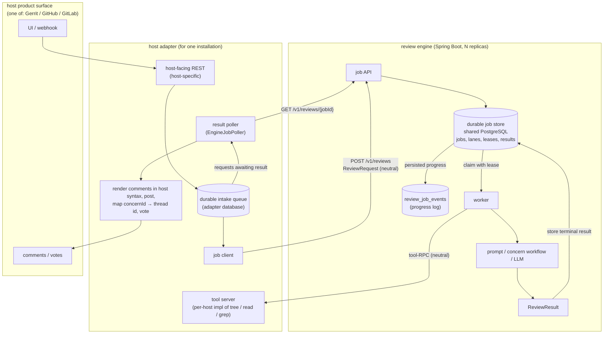

# Proposal: Split the ReviewAI engine from the host plugins

- **Status:** Proposal (under review)
- **Date:** 2026-08-29, revised 2026-09-19
- **Goal:** maintainability and reuse — a product-neutral review engine that scales independently

> **Revision note (2026-09-19).** This document supersedes the 2026-08-29 proposal. That proposal
> already called for a product-neutral engine reusable by Gerrit, GitHub, GitLab, or an IDE, with an
> incremental path from an in-process interface to a service. It proposed a **stateless** engine, with
> the Gerrit adapter owning all review state, and pre-fetched code context with no I/O mid-review. It
> left transport, asynchronous execution, persistence ownership, deployment topology, and configuration
> ownership open.
>
> This revision retains product neutrality, reuse, and incremental delivery, while resolving those open
> choices differently: the remote engine is a horizontally scalable Spring Boot service, owns review
> state, and obtains on-demand code context through adapter callbacks. References below to the "prior
> proposal" mean this baseline; no earlier document is required to understand the current design.
>
> A further decision shapes the packaging: the engine service is developed as a **separate,
> proprietary repository** (`reviewai-backend`), while this repository stays Apache-2.0 and **keeps its
> in-process engine**. The split is therefore **optional** — a site may run the engine in-process as it
> does today, or point the adapter at a remote engine. Nothing is shared as a Java artifact: the two
> sides agree on the wire format, which this repository publishes as a JSON Schema with conformance
> vectors. [§14.1](#141-two-repositories-and-what-actually-crosses-between-them) and [§14.2](#142-how-two-independently-written-sides-stay-in-agreement) record that.

## Glossary

| Term | Meaning in this proposal |
|---|---|
| **Host installation** | One independently operated Gerrit site, GitHub org, or GitLab group using ReviewAI. This is the isolation boundary ([§4.1](#41-topology)). |
| **Adapter** | The host-specific integration for an installation: the ReviewAI plugin in Gerrit. It accepts host events, supplies code context, and publishes results. Several running copies may serve one installation ([§4.1](#41-topology)). |
| **Engine** | The product-neutral review workflow: agents, prompts, model calls, and concern handling. It runs inside the host in in-process mode or as a separate service in remote mode ([§4.1](#41-topology)). |
| **Engine deployment** | The remote engine service assigned to one host installation, including its shared review-state database. It may run multiple replicas ([§4.1](#41-topology)). |
| **Replica** | One running copy of an engine deployment. Replicas share its job store and can serve or claim work independently ([§7.3](#73-replica-coordination)). |
| **Multi-tenancy** | One engine deployment serving several unrelated host installations while isolating their jobs and state within that service. It is out of scope here ([§2](#2-goals-and-non-goals)). |
| **In-process mode** | The engine runs in the host process and uses the plugin's existing state store ([§4.1](#41-topology)). |
| **Remote mode** | The adapter submits reviews to a separate engine deployment, which owns its review state ([§4.1](#41-topology), [§9](#9-ownership-matrix)). |
| **Contract / wire format** | The JSON request, result, and callback formats agreed by adapter and remote engine; the two repositories do not share Java classes ([§5](#5-the-contract), [§14.1](#141-two-repositories-and-what-actually-crosses-between-them)). |
| **Review job** | A durable unit of review work admitted by the remote engine. Its lifecycle state is separate from a concern's status ([§7.1](#71-job-api)–[§7.2](#72-job-state-machine)). |
| **Lane** | The per-change scheduling boundary that prevents two reviews of the same change from updating state at once ([§7.3](#73-replica-coordination)). |
| **Lease** | A time-limited worker claim on a job; expiry lets recovery handle a stalled worker ([§7.3](#73-replica-coordination)). |
| **Concern** | A code-review issue tracked across reviews. Its `ConcernStatus` is separate from a review job's state ([§7.2](#72-job-state-machine)). |
| **Concern ledger** | The stored history of concerns for a change; its owner depends on the deployment mode ([§9](#9-ownership-matrix)). |
| **Finding** | An item in `ReviewResult` that the adapter can render and publish as a host comment, possibly linked to a concern ([§5.3](#53-response), [§6.3](#63-comment-rendering-moves-to-the-adapter)). |
| **Publication** | The adapter's act of posting findings, messages, or votes to the host; it must be idempotent across review retries ([§8](#8-idempotency-and-the-at-least-once-contract), [§11](#11-publication-is-a-pull)). |
| **Concern-to-host-comment map** | The adapter-owned mapping from a concern id to its published host comment id, used to keep later updates on the right thread ([§8](#8-idempotency-and-the-at-least-once-contract)). |
| **Tool-RPC** | Authenticated remote procedure calls from the engine to the adapter for on-demand code context during a review ([§12](#12-code-context-the-tool-rpc-contract)). |
| **SSE** | Server-Sent Events: the engine's HTTP progress stream to the adapter, backed by stored event rows ([§7.4](#74-progress-delivery)). |
| **Bootstrap / `StateBootstrap`** | The one-time initialization of a change's engine state from legacy adapter state, and the snapshot used for that transfer ([§13.1](#131-strategy-lazy-per-change-bootstrap-engine-authoritative-from-first-contact)). |
| **Rollback** | Returning a site from remote to in-process mode after copying newer engine state back to the adapter ([§13.3](#133-rollback)). |

## 1. Context and motivation

Today the plugin is a single Gerrit process. The AI review engine (LangChain4j integration, prompt
building, concern workflow, agents) is intertwined with the Gerrit-specific integration (event
listeners, Gerrit API clients, web endpoints, plugin data storage).

Three forces make this painful:

1. **Every change to the AI logic is coupled to Gerrit.** The engine's entry point takes Gerrit types
   (`GerritChange`, `ChangeSetData`), so the engine cannot be built, tested, or reasoned about without
   the Gerrit environment.
2. **The engine could serve more than Gerrit.** The review capability is product-agnostic ("code
   context + prior review state" in, "comments / concerns / score" out). GitHub, GitLab, or an IDE
   could reuse it, but only if the engine is extracted behind a neutral contract.
3. **Review work must scale independently of the host.** A review is long-running and makes many model
   calls. Today it competes for the same process and thread pools as Gerrit's request handling.

This document proposes extracting the engine into a standalone Spring Boot service and turning each
host plugin into an adapter. The primary goal remains maintainability; independent scaling and reuse
follow from the same boundary.

## 2. Goals and non-goals

### Goals

- Decouple the AI engine from Gerrit types and Gerrit lifecycle.
- Define a stable, neutral contract (`ReviewRequest` / `ReviewResult`) that names no host product.
- Run the engine as a horizontal-scaling service: N replicas behind a load balancer over one shared
  database, with any replica able to accept or serve any request.
- Allow the engine to be reused by other products via new adapters.
- **Keep this repository self-contained.** The plugin must remain buildable, releasable, and fully
  functional from public sources alone, with the in-process engine as a supported mode. The remote
  engine is additive, never a build requirement of the open plugin ([§14.1](#141-two-repositories-and-what-actually-crosses-between-them)).
- Land the change incrementally, without a big-bang rewrite.

### Non-goals

- No change to the browser sidebar UX. The sidebar's polling contract is preserved (see [§12.4](#124-degradation-must-be-observable)).
- No change to the *concern workflow* semantics (concerns, voting, feedback memory).
  **Deliberate exception:** host comment *rendering* moves to the adapter ([§6.3](#63-comment-rendering-moves-to-the-adapter)). This changes how the
  final comment text is composed and is expected to carry a comment-quality risk until measured.
- **No multi-tenancy across host installations.** In remote mode, each installation gets its own engine
  deployment and review state ([§4.1](#41-topology)). Multiple replicas of that deployment still serve the same
  installation.

> **Changed from the prior proposal.** It listed "Not (yet) a multi-tenant or high-throughput
> service design" as a non-goal. Scale-out is now a requirement, not a non-goal. Multi-tenancy remains
> out of scope, but now for a stated reason rather than as a deferral: each install gets its own
> engine deployment.
>
> The prior proposal also listed "No re-platforming of persistence or config in the first iteration".
> That no longer applies: persistence moves to the engine's own database ([§13](#13-state-migration)), and configuration is
> split between
> adapter-resolved and engine-owned ([§5.4](#54-config-resolved-by-the-adapter-shipped-flat)).

## 3. Current architecture and coupling points

Logical layers that exist today:

| Layer | Package / location | Role |
|---|---|---|
| Browser sidebar | `static/reviewai/*` | UI, talks to the plugin's REST endpoints |
| Gerrit integration | `listener/`, `web/` | Gerrit events, REST endpoints, command parsing |
| Orchestration | `review/` | `PatchSetReviewer`, `TopicPatchSetReviewer`, lifecycle |
| AI engine | `aibackend/langchain/` | `LangChainClient`, providers, prompt factory, concern workflow, agents |
| Shared models | `aibackend/common/` | `AiResponseContent`, `ChangeSetData`, concern models |
| Persistence | `data/` | `ReviewAiDb`, concern/feedback/status stores |
| Config | `config/` | Gerrit-sourced `Configuration` |
| Metrics | `metrics/` | request/cost tracking |

The engine is coupled to Gerrit in these concrete ways:

1. **Gerrit types in the engine entry point.**
   `IAiClient.ask(ChangeSetData, GerritChange, String patchSet)`. `LangChainClient`,
   `AiPromptFactory`, and the concern workflow all take `GerritChange` / `GerritClient`.
2. **`ChangeSetData` is a grab-bag.** It mixes engine state
   (`incrementalPatchSet`, `concernWorkflowInput`, `reviewFeedbackMemory`,
   `previousReviewConcernLedger`) with Gerrit command/UI state (`forcedReview`,
   `parsedCommands`, `suggestMode`, `reviewScope`, `hideAiReview`,
   `reviewSystemMessage`, …).
3. **On-demand code-context tools reach into the git repo.**
   `treeTool` / `getContentTool` / `grepTool` read files via
   `GitRepoFiles` / `repositoryManager`, which only exist inside Gerrit.
4. **Persistence is Gerrit-tied.** The concern ledger, feedback memory, and OpenAI conversation id live
   in Gerrit plugin data (`ReviewAiDb` / `PluginDataHandler`).
5. **Config is Gerrit-sourced.** `Configuration` reads `gerrit.config` and project-level overrides.
6. **Listener and web layers are inherently Gerrit.** `GerritListener`, the `EventHandlerType*`
   classes, and `ChangeResource` / `ChangeApi` cannot be shared with another product.

The prior proposal treated `ReviewConcern`, `ConcernStatus`, `ReviewerConcerns`, `ConcernLedger`, and
`ReviewFeedbackMemory` as already product-agnostic except for `ReviewConcern.previousCommentId`, which
it identified as the only Gerrit leak. It proposed renaming that field to `threadId`, but did not
account for the following additional couplings and consequences:

7. **Cancellation is in-process.** `AiRequestCancellation` carries request-scoped cancellation through
   a `ThreadLocal`, and the durable `SUPERSEDE_REQUESTED` state is polled by the *same* worker that
   holds the lease. Correctness depends on worker and lease owner being one process.
8. **Historical concern correlation is persisted, so changing it requires data migration.**
   `ReviewConcern.previousCommentId` is serialized inside `concern_json` under the Gson names
   `past_comment_id` / `previous_comment_id`
   (`aibackend/common/model/review/ReviewConcern.java:55-56`). Existing values may identify either
   a Gerrit comment or a prior concern, as explained in [§5.1](#51-what-the-contract-must-carry-and-why-changeref-is-not-what-youd-guess). Renaming or redefining the field is
   therefore not cosmetic and requires a migration strategy.
9. **Feedback comment state stores Gerrit comment ids.**
   `review_feedback_comments.comment_id` (`data/ReviewAiDb.java:263-271`) is a Gerrit comment id in a
   table the engine would otherwise own.
10. **Prompts read Gerrit types.** `ChangeSetData.permittedVotingRange` (`GerritPermittedVotingRange`)
    and `conditionLabels` (`GerritConditionLabel`) are consumed by prompt construction.

## 4. Target architecture

### 4.1 Topology

There are **two supported modes**, and the adapter chooses between them by configuration. This is what
keeps the open plugin self-contained while allowing a scaled deployment.

For Gerrit, the adapter is the ReviewAI plugin running on the site's Gerrit nodes. Several nodes may
run copies of the plugin, but they belong to the same installation and must share the adapter's intake
queue in remote mode ([§8](#8-idempotency-and-the-at-least-once-contract)). That adapter submits reviews to its installation's engine deployment, which
may itself have multiple replicas.

| Mode | Engine | Review state lives in | Available to |
|---|---|---|---|
| **In-process** (default) | `aibackend/`, in the host JVM — today's behaviour | The plugin's own database | Anyone building this repository |
| **Remote** | The Spring Boot service, N replicas over one PostgreSQL | The engine's database ([§9](#9-ownership-matrix)) | Deployments that want independent scaling |

The diagram below shows **remote mode**. In-process mode is the current architecture with the
`ReviewEngine` contract introduced as an internal seam (migration Steps 1–3, [§15](#15-implementation-and-rollout-sequence)).



The host-product box shows where reviews originate and are published; it does not imply a separate
process from the adapter.

Key properties:

- **One engine deployment per host install** (a Gerrit site, a GitHub org, a GitLab group), running the
  same engine code and contract. Isolation comes from the deployment.
- **N engine replicas over one shared PostgreSQL.** Any replica can accept a submission, run a job, or
  report a result.
- **Two durable queues are in series.** The adapter intake queue absorbs host events before the
  network call, so an engine outage does not lose work. The engine job store then coordinates
  execution across replicas ([§8](#8-idempotency-and-the-at-least-once-contract)).

> **Changed from the prior proposal.** It stated: *"The engine is stateless. The adapter owns the
> concern ledger, feedback memory, and conversation id, and passes them per request."* This is now
> **reversed** — the engine owns them ([§9](#9-ownership-matrix)). The reason is not preference: two writers to one ledger
> reintroduce exactly the split-brain the concern ledger exists to prevent, and a stale request could
> overwrite newer engine state.

### 4.2 The three REST surfaces

"The API is the same for Gerrit, GitHub and GitLab" is true of exactly two of three surfaces. Being
precise about which-is-which is what keeps the engine host-agnostic.

| Surface | Shared? |
|---|---|
| **Engine API** — `POST /v1/reviews`, `GET /v1/reviews/{id}`, `POST /v1/reviews/{id}/cancel`, SSE | **Identical.** One contract, one engine, three adapters. |
| **Tool-RPC protocol** — engine → adapter, for code context | **Identical interface, per-host implementation.** Gerrit runs JGit against the local repository; GitHub uses the contents/search/trees API or a clone; GitLab likewise. |
| **Host-facing REST** — what each product's UI calls | **Not shared and necessarily different.** Gerrit's endpoints are `ChangeResource`-scoped; GitHub's are webhooks plus GitHub App auth; GitLab's are its own. Entirely adapter-internal. |

The engine never learns which host it is serving. That is the test of whether the neutrality is real.

## 5. The contract

The contract is the **wire format**, not a shared Java artifact: two independently-written types, one
per side, agreeing on JSON ([§14.1](#141-two-repositories-and-what-actually-crosses-between-them)). It names no host product, and — for a non-obvious reason — the
types on both sides carry no Jackson or Gson annotations ([§14.5](#145-jackson-relocation-and-the-wire-contract)).

### 5.1 What the contract must carry, and why `ChangeRef` is not what you'd guess

**`ChangeRef` must not be Gerrit-shaped.** A natural first draft carries `project`, `branch`,
`changeKey`, `patchSetNumber`, `fullChangeId`, `topic` — every one of which is Gerrit vocabulary. None
exist on GitHub, where a change is `repo + PR number + head SHA`.

The neutral shape is a small core plus an **opaque locator**:

```java
public record ChangeRef(
    String hostId,      // opaque host install identity, e.g. a Gerrit instance id or a GitHub App installation
    String changeId,    // opaque change identity — a Gerrit change number, a PR number, an MR iid
    String revision,    // opaque revision identity — the commit the review targets
    String locator      // opaque to the engine; echoed back verbatim on tool-RPC
) {}
```

The engine uses `hostId` + `changeId` as its **lane key** (the unit of per-change serialization) and
`revision` for freshness checks and `lastReviewedCommit`. It never interprets `locator`; the adapter
puts whatever it needs to resolve the change back into a host object, and gets it back on every
tool-RPC call. This is what lets Gerrit carry `project~branch~Change-Id`, GitHub carry
`owner/repo#number`, and GitLab carry `group/project!iid` through one field.

**Historical concern correlation is a data migration, not a field rename.** The current implementation
uses `ReviewConcern.previousCommentId` as a historical correlation reference. Despite its name, the
value has two meanings:

- a host comment id when the concern was matched against `past_comments`;
- a prior concern id when the match came from conversation history.

The prior proposal mapped `ReviewConcern.previousCommentId` to a neutral `threadId` and treated that as
the only required change. That is incomplete because:

- it is persisted inside `concern_json` (`ReviewConcern.java:55-56`);
- it is a **required** field in two LLM output schemas
  (`config/formatSpecializedHistoricalRepetitionSchema.json:15,18` and
  `config/formatSpecializedConflictResolutionSchema.json:34,58`);
- it is the join key from review feedback back to concerns
  (`aibackend/langchain/client/api/LangChainReviewFeedbackClassifier.java:145-146`);
- consumers cannot interpret it as a thread id without first knowing which of the two meanings applies
  (`agents/level2/SpecializedReviewRepetitionMerger.java:198`).

Resolution: the historical correlation reference leaves the engine's **persisted** state, but still
flows **through** the engine on each request because the schemas require it and changing them would
change concern-workflow behaviour. Here the "no semantic change" non-goal holds — unlike [§6.3](#63-comment-rendering-moves-to-the-adapter), where
it is deliberately relaxed. The adapter supplies `priorPublications` and owns the mapping; the engine
returns `concernId`s.

### 5.2 Request

```java
public record ReviewRequest(
    int schemaVersion,          // major; the engine rejects unknown majors
    String adapterInstanceId,   // idempotency key part 1
    String requestId,           // the adapter's durable request id — key part 2
    int attempt,                // key part 3; increments on re-dispatch after a terminal non-COMPLETED
    long queueSequence,         // preserves the adapter's lane FIFO order across the boundary
    ChangeRef change,
    ReviewTarget target,
    ReviewIntent intent,
    ResolvedConfig config,
    StateBootstrap bootstrap,   // nullable; migration only (§13)
    Instant requestedAt,
    String traceId) {}

public record ReviewTarget(
    String patch,                    // the diff under review
    List<String> changedFiles,       // scopes on-demand code context
    String commitMessage,            // nullable; adapter resolves any host pseudo-file into this
    List<String> commitMessageLines) {}

public record StateBootstrap(        // nullable; present only while migrating a change (§13)
    LedgerSnapshot priorConcerns,
    FeedbackSnapshot feedback,
    String incrementalPatch,
    int schemaVersion) {}

public record ReviewIntent(
    ReviewAssistantStage stage,
    ReviewScope scope,
    boolean forced,
    boolean forcedStagedReview,
    boolean suggestMode,
    boolean debugReview,
    boolean replyFilterEnabled,
    boolean commentEvent,
    AgentSpecialization agent,          // SINGLE_AGENT | SCOPED_AGENTS | SPECIALIZED_AGENTS
    SpecializedAgent specializedAgent,  // nullable
    String conversationSuffix,          // nullable; feeds the memory scope
    ScoreRange permittedScoreRange,     // NEUTRAL form of the host's voting model (§6.2)
    Map<String, ConditionLabel> conditionLabels,
    List<String> dataPrompt) {}
```

**`priorConcerns` and `feedback` are absent from normal steady-state requests.** Once a change is in
remote mode, the engine reads that history from its own store and is its only writer. Sending a copy with
every review, as the prior proposal did, would let a delayed or retried request bring back older history.
For example, it could supply a concern as `PRESENT` after a newer review marked it `FIXED`.

The one-time exception is migration: before the first remote review of a change, the engine needs a
verified `StateBootstrap` snapshot of its legacy history. An empty snapshot is valid only after the
adapter confirms there is no prior state; if the old state cannot be read, the job must fail and retry
instead of starting with an empty history ([§13.1](#131-strategy-lazy-per-change-bootstrap-engine-authoritative-from-first-contact)–[§13.2](#132-distinguish-missing-history-from-unreadable-history)). The record above shows `StateBootstrap` as an
optional request field, while [§13.1](#131-strategy-lazy-per-change-bootstrap-engine-authoritative-from-first-contact) describes fetching it through a callback. Those two descriptions
need one agreed transport before implementation.

> **Changed from the prior proposal.** Its `ReviewContext` carried `priorConcerns`, `feedback`, and
> `incrementalPatch` on every request, while `ModelConfig` carried a `conversationId` described as
> *"optional, frontend-owned, for stateful conversations"*. Both are reversed: the engine owns that
> state. `conversationId` leaves the contract entirely and moves to an engine table keyed by change and
> scope.

### 5.3 Response

```java
public record ReviewResult(
    int schemaVersion,
    String jobId,
    ReviewState state,               // COMPLETED | FAILED | SUPERSEDED | CANCELLED
    List<Finding> findings,
    String message,                  // optional change-level message
    Double score,                    // optional aggregate score
    CostReport cost,
    String failureReason) {}         // nullable

public record Finding(
    String findingKey,   // deterministic identity — see §8; load-bearing, not opaque
    String filename,
    Integer lineNumber,
    String codeSnippet,
    String message,      // prose; contains no host syntax (§6.3)
    String suggestion,   // nullable; structured replacement text, rendered by the adapter
    String concernId,    // the adapter maps this to a host thread
    Double score, Double relevance,
    boolean repeated, boolean duplicated, boolean conflicting,
    String repeatedReason, String duplicatedReason, String conflictingReason) {}
```

`ReviewResult.updatedConcerns` is **removed** — the engine already persisted them. `Finding.id` becomes
`findingKey` and is now a deterministic content hash rather than an opaque id; [§8](#8-idempotency-and-the-at-least-once-contract) explains why that is
required rather than merely convenient. `ReviewResult.state` describes the terminal review outcome,
not every internal job state; [§7.2](#72-job-state-machine) defines the mapping for an expired worker lease.

### 5.4 Config: resolved by the adapter, shipped flat

The adapter fully resolves configuration and sends effective values. The engine merges nothing.

This is not a stylistic choice. `ConfigCore`'s override semantics are subtle enough that porting them
would mean faithfully reimplementing a tricky function in a second process with no engine-side test
coverage:

| Key type | Actual semantics | Location |
|---|---|---|
| `getString` | project-first, else global | `config/ConfigCore.java:82-88` |
| `getInt` | project wins only if non-default, non-zero, *and* present as a string | `config/ConfigCore.java:164-175` |
| `getBoolean` | project wins iff the key exists as a string | `config/ConfigCore.java:177-183` |
| list keys | **additive concatenation**, global then project | `config/ConfigCore.java:211-214, 224-254` |
| `…WithProjectOverride` lists | project **replaces** global | `config/ConfigCore.java:216-222` |
| provider/model/token routes | project-override lists, additive token merge | `config/AiProviderConfiguration.java:107-109, 169-181` |
| dynamic per-change | merged from plugin data *before* `Configuration` is constructed | `config/ConfigCreator.java:73-79, 97-115` |

```java
public record ResolvedConfig(
    int schemaVersion,
    String provider, String model, String domain,
    double temperature,
    String instructions,             // resolved project instructions, including host-specific fragments
    int maxToolResponseRounds, int maxMemoryTokens,
    CodeContextPolicy codeContextPolicy,
    List<String> enabledFileExtensions, List<String> disabledFileExtensions,
    List<PricingEntry> pricing,      // resolved effective list; engine computes cost
    String credentialRef,            // OPAQUE. Never a token — see §14.6.
    List<AiModelRoute> modelRoutes,
    Map<String, String> hints) {}    // forward-compat escape hatch; unknown keys ignored
```

`credentialRef` is opaque so the request never contains a token; see [§14.6](#146-credentials).

Two config planes, stated explicitly:

- **Adapter-resolved, per request:** everything host-, project-, and change-derived. Adding a config
  key requires no engine change.
- **Engine-owned, deployment-scoped:** database URL, thread pools, job TTL, tool-RPC endpoint and
  secret, global model gate, retention.

Trade-off to accept: the engine cannot validate adapter config keys, so a typo surfaces as behaviour
rather than a startup error. The adapter already has `unknownEnumSettings`
(`config/ConfigCore.java:57, 189-197`) as the place to warn.

## 6. Product neutrality

### 6.1 The three gaps

Neutral names on the wire are not enough. Three things make the sameness real, and the first was a
defect in the design review's own proposal:

1. **The state key** — `ChangeRef` must be a neutral core plus opaque locator ([§5.1](#51-what-the-contract-must-carry-and-why-changeref-is-not-what-youd-guess)), not Gerrit's
   project/branch/patch-set vocabulary.
2. **Score semantics** — see [§6.2](#62-score-semantics).
3. **Comment syntax** — see [§6.3](#63-comment-rendering-moves-to-the-adapter).

### 6.2 Score semantics

Prompts currently consume Gerrit's `permittedVotingRange` (`ChangeSetData.java:54`), and Gerrit's
scoring model — a numeric label range — does not exist on GitHub, which has review *states*
(approve / request-changes), nor on GitLab, which has approvals.

The neutral form is a permitted score range as a plain number pair (`ScoreRange`), which each adapter
maps onto its own primitive. Whether a host can express the score at all becomes an adapter concern,
not an engine one.

### 6.3 Comment rendering moves to the adapter

Gerrit's ```suggestion block syntax is a host mechanic, and it is currently taught to the model by the
prompt assets. **Decision: findings stay structured and the adapter renders them.**

- The engine emits `Finding.message` as prose and `Finding.suggestion` as structured replacement text.
- Each adapter renders its host's syntax — Gerrit's ```suggestion blocks, GitHub's suggestion fences,
  GitLab's equivalent.
- The engine never names a host syntax.

The model still writes the finding's explanation in `Finding.message`. It returns any proposed
replacement separately in `Finding.suggestion`, without a suggestion fence. The adapter combines
those fields into the comment it publishes: on Gerrit it wraps the replacement in Gerrit's ```suggestion
syntax; another host uses its own format. Rendering does not mean that the adapter
rewrites the model's explanation.

Consequences to be honest about:

- **The model no longer composes the complete published comment.** The adapter now assembles the
  model's explanation, optional replacement text, and host formatting. This is the deliberate
  exception to the concern-workflow non-goal ([§2](#2-goals-and-non-goals)): the final comment's wording or presentation may
  differ even when the finding is the same. Compare rendered comments with current output to measure
  the quality risk, and revisit the decision if there is a real regression.
- **Prompt neutralisation becomes a required workstream, not a tidy-up.** There are 17 `Gerrit`
  references across 6 files under `src/main/resources/config/`, and they split into two classes:
  - *Essential host mechanics* — Suggested Edits syntax and the `/COMMIT_MSG` pseudo-file. Both leave
    the engine entirely: syntax to the adapter's renderer, `/COMMIT_MSG` to the adapter resolving it
    into the neutral `commitMessage` field.
  - *Vocabulary* — "Gerrit patch", "Gerrit review comment", "Gerrit comments". Cheap to neutralise.
- Product-specific instructions that affect review behaviour can remain in
  `ResolvedConfig.instructions`; comment-format instructions belong in the adapter's renderer.

## 7. The service

### 7.1 Job API

| Method | Path | Behaviour |
|---|---|---|
| `POST` | `/v1/reviews` | Validate, admit, return `202 {jobId, state: QUEUED}`. **On an existing idempotency key, return `200` with the existing job — never 409.** |
| `GET` | `/v1/reviews/{jobId}` | Current state and, when terminal, the `ReviewResult`. |
| `GET` | `/v1/reviews/{jobId}/events` | SSE progress stream ([§7.4](#74-progress-delivery)). |
| `POST` | `/v1/reviews/{jobId}/cancel` | Cooperative cancellation ([§10](#10-cancellation-across-the-boundary)). |
| `GET` | `/v1/meta` | Supported contract versions, for adapter startup checks. |

`POST` must return `200` rather than `409` on a duplicate key because the adapter cannot distinguish
"my POST timed out" from "my POST never arrived". A conflict response is therefore unusable — it would
force the adapter either to retry blindly or to treat an unknown outcome as failure.

### 7.2 Job state machine

The names below come from the adapter's `data/AiRequest.java`. They describe the lifecycle of an
**AI request**, not a review concern. A concern has a separate `ConcernStatus` (`PRESENT`, `FIXED`,
`UNCERTAIN`, `SKIPPED`, `DISMISSED`). The engine reuses the adapter's queue, lease, and cancellation
design, but its job states are not a verbatim copy of the adapter's enum.

| State | Meaning | Used as an engine job state? |
|---|---|---|
| `QUEUED` | Accepted, waiting for a worker. | Yes. |
| `RUNNING` | Claimed by a worker with a lease. | Yes. |
| `SUPERSEDE_REQUESTED` | Stop requested because the work is stale or explicitly cancelled; the worker has not finished stopping. | Yes, pending a `SUPERSEDED` or `CANCELLED` outcome according to the reason. |
| `COMPLETED` | Review finished successfully. | Yes, terminal. |
| `FAILED` | Review execution failed. | Yes, terminal. |
| `REJECTED` | Adapter refused admission because the change was already occupied (`REJECT_IF_OCCUPIED`). | No. An engine `POST` refusal creates no job and returns an error response. |
| `SUPERSEDED` | An outdated request stopped without producing a publishable review. | Yes, terminal. |
| `ABANDONED` | A running worker's lease expired before completion; this does **not** mean the host change was abandoned. | Yes, terminal; exposed as a failed `ReviewResult` with a lease-expiry `failureReason`. |
| `CANCELLED` | An explicit cancellation finished after the worker stopped. | Yes, terminal; this state is new to the engine contract. |

The engine job's `isTerminal()` covers `COMPLETED`, `FAILED`, `SUPERSEDED`, `ABANDONED`, and
`CANCELLED`. `GET /v1/reviews/{jobId}` exposes the job state; its terminal `ReviewResult.state` uses
the narrower outcome list in [§5.3](#53-response) (`ABANDONED` maps to `FAILED`). A duplicate idempotency key still
returns the existing job as described in [§7.1](#71-job-api); it is not an admission rejection.

### 7.3 Replica coordination

The proposed remote topology puts N engine replicas behind a load balancer over one shared PostgreSQL
([§2](#2-goals-and-non-goals), [§4.1](#41-topology)). The adapter sends job API calls to that deployment; the load balancer selects the replica
that handles each HTTP call. Its routing policy, including whether it considers workload, is not
specified here. HTTP routing is separate from job assignment: the receiving replica persists the job,
then a worker on any replica may claim it from the shared store.

For example, the load balancer could send `POST /v1/reviews` to replica A, which stores job 42 as
`QUEUED` and returns its ID. A worker on replica B could then claim job 42 from PostgreSQL and change
it to `RUNNING` with a lease; A does not forward the job to B. If A's worker also tries to claim it,
the database transaction prevents a second claim. A later `GET /v1/reviews/42` could go to either
replica, since both read the shared job store. This illustrates the proposed design, not an existing
engine implementation.

The adapter already uses a lane, claim, and lease design to coordinate its own request workers. The
engine would implement that *design* in its own job tables, not share the adapter's tables ([§14.7](#147-reuse-the-design-not-the-tables)):

- `data/AiRequestStore.claimNext` (`data/AiRequestStore.java:75-136`) locks the lane, then flips
  `QUEUED → RUNNING` with owner and lease and sets the lane's active request **in one transaction**,
  asserting both updates affect exactly one row. This is precisely the claim primitive a multi-replica
  job store needs — no new concurrency design is required.
- `listener/AiRequestCoordinator.java` implements per-change serialization, lease renewal at
  `leaseMillis / 3`, owner-checked completion, and periodic recovery of expired leases.
- `docs/architecture/request-coordination.md` states the invariants in prose and they transfer
  unchanged.

The engine must also split its pools: intake, worker, and lease/recovery must not share a bounded pool,
or a long review can block event intake. This applies to the adapter as well ([§15](#15-implementation-and-rollout-sequence), Step 0).

### 7.4 Progress delivery

The engine sends progress to the adapter over SSE. It saves progress events in `review_job_events`.
The database is the durable record. When a job state changes, the engine updates the job row and
inserts the corresponding `review_job_events` row **in the same transaction**. Either both changes
commit or neither does. The SSE endpoint only reads stored event rows and sends them over HTTP; it
does not own a second copy of job state.

For example, job 42 moves from `QUEUED` to `RUNNING`, and event `seq = 7` records that transition.
The adapter receives event 7, then its SSE connection drops while event 8 is stored. On reconnect,
the adapter sends `Last-Event-ID: 7`; the SSE handler reads rows with `seq > 7` and sends event 8.
It then polls for new rows to keep the stream current. The dropped connection did not lose the event,
and `GET /v1/reviews/42` can still report the job's current state. Exact stream termination and
replica-restart edge cases remain open in question 7 of [§17](#17-open-questions).

No broker is required. Postgres `LISTEN/NOTIFY` is an optional latency optimisation only, and should be
treated as such: it is fire-and-forget, non-durable, needs a dedicated non-pooled connection, and has a
payload cap. It could wake the SSE handler sooner than the next poll, but the handler still reads the
event rows from PostgreSQL.

**The stream's consumer is the adapter, not the browser.** Exposing engine SSE to the browser would
need CORS, leak the engine URL and its auth model, and be broken by any reverse proxy that buffers
responses. The sidebar's existing contract — poll `ai-review-message-status` every 1000 ms for up to
120 s — is preserved unchanged, which is also what the stated non-goal requires. If a live-progress UI
is ever wanted, the adapter proxies the stream.

### 7.5 Graceful shutdown

Reviews must not run on the request thread. `POST` persists and returns; a worker claims. Shutdown is
then: stop claiming, stop renewing leases, and let in-flight jobs either finish within the drain window
or be reclaimed by another replica's recovery pass.

A mid-LLM-call worker cannot be interrupted, so reclaiming a job **re-runs the review from scratch**.
That is only safe because publication is idempotent ([§8](#8-idempotency-and-the-at-least-once-contract)) — an ordering constraint, not a nicety. On
`SIGTERM` the engine must also abort in-flight tool-RPCs so the adapter's bounded tool executor is not
left holding requests whose caller is gone.

## 8. Idempotency and the at-least-once contract

This is the deepest consequence of the split and was not addressed by the prior proposal.

Today a review runs once; a crash loses the work. After the split, a re-dispatch — adapter restart,
engine replica restart, lease expiry, a retryable model outage — **re-runs the review**. Nothing in the
publication path is idempotent: `PatchSetReviewer` posts comments unconditionally
(`review/PatchSetReviewer.java:182-190`). Patch-set freshness is validated, but a re-run of the *same*
patch set is not filtered.

**Therefore idempotent publication must land before the split**, or graceful shutdown and retry become
duplicate-comment generators.

The mechanism:

- The engine assigns `findingKey = sha256(changeRef, revision, concernId, filename, line, normalizedMessage)`.
- The adapter keeps `published_findings(change_id, revision, finding_key, comment_id, published_at)`
  with a unique index, and skips findings already recorded, reusing the recorded `comment_id` for the
  thread.
- The adapter stores the **concern-to-host-comment map** in
  `concern_comment_ids(change_id, concern_id, comment_id)`. It uses the map to attach later findings
  for the same concern to the existing host thread. The map replaces `previousCommentId` currently
  written into the engine's ledger (`data/ReviewConcernPublisher.java:70-83`; see also [§5.1](#51-what-the-contract-must-carry-and-why-changeref-is-not-what-youd-guess)).

### Boundary idempotency key

The adapter's existing key `(gerrit_instance_id, change_number, source_event_id)` is correct *inside*
the adapter but **unsafe across the boundary**:

- `AiRequestDescriptor.resolveSourceEventId` (`listener/AiRequestDispatcher.java:184-193`) **synthesizes**
  the id from `patchSetEventKey:eventType:eventCreatedOn` when the event has none, so two distinct
  requests can collide.
- The adapter deletes its rows on merge/abandon with no tombstone
  (`docs/architecture/request-coordination.md:188`). If the engine retains a job longer, a re-created
  adapter request for the same triple could match a **stale terminal** engine job and be handed an old
  result.

The adapter's own `requestId` — a fresh `UUID.randomUUID()` per admission
(`listener/AiRequestDispatcher.java:137`) — is the true identity of a unit of work. So:

**Engine idempotency key = `(adapterInstanceId, requestId, attempt)`.**

`ChangeRef` remains the engine's **lane** key (it must serialize per change) but is not its uniqueness
key. `attempt` increments only when the adapter re-dispatches after observing a terminal
non-`COMPLETED` job. Engine job TTL must be **≤** the adapter's, or the staleness collision returns.

### A deployment precondition not covered by the prior proposal

The prior proposal did not define a durable handoff. This revised design implicitly relies on the
adapter's durable queue to retain accepted work until the engine accepts it. That guarantee is
**conditional**: every adapter replica must use the same queue.
`ReviewAiDb` defaults to an embedded H2 file over a TCP server pinned to `localhost:9092` with
`AUTO_SERVER=FALSE` (`data/ReviewAiDb.java:52-54, 126-129`); external PostgreSQL is opt-in via
`storeUrl`. If Gerrit runs more than one replica, there are two independent queues, the unique index
dedupes nothing, and the same event can be admitted twice.

**Shared PostgreSQL for the adapter's queue is a documented precondition of the handoff**, and should
be a startup check: refuse to enable the engine handoff when the dialect is H2.

## 9. Ownership matrix

Ownership is **mode-dependent**, which matters because in-process mode ([§4.1](#41-topology)) is still supported:

- **In-process mode** — adapter and engine are one process over one database. The matrix below
  collapses: everything is owned where it is owned today, and nothing in this section applies.
- **Remote mode** — the split below applies.

| State | Owner in remote mode | Authoritative | Who may delete |
|---|---|---|---|
| Adapter intake queue (`ai_requests`, `ai_request_lanes`) | Adapter | Adapter | Adapter (current lifecycle rules) |
| Engine jobs, lanes, events | Engine | Engine | Engine only |
| Concern ledger | Engine | Engine | Engine, on adapter request |
| Feedback memory | Engine | Engine | Engine, on adapter request |
| Chat memory, conversation id | Engine | Engine | Engine |
| Concern → thread id map | Adapter | Adapter | Adapter |
| Feedback comment handles | **Undecided** — see question 1 in [§17](#17-open-questions) | | |
| Sidebar conversation history | Adapter | Adapter | Adapter (unchanged) |

Two rules follow:

1. **The adapter must never delete engine state**, and the engine must never delete adapter state.
2. **Cleanup must wait for in-flight work.** Cleanup ordering carries over from the existing design:
   deletion must run *after* scheduled work for the change is idle, so an in-flight model call cannot
   recreate memory after deletion (`docs/architecture/request-coordination.md:180-182`). Suppose a change
   is merged while its review is waiting for a model response. If the engine deletes the concern ledger
   and chat memory immediately, the worker could receive the response and write new state after cleanup.
   Today the in-process coordinator waits until scheduled work for the change is idle before clearing that
   state (`docs/architecture/request-coordination.md:180-182`). In remote mode, the adapter requests
   cancellation, and the engine clears its own state only after the worker has stopped or can no
   longer write. An unowned lane alone is insufficient after a lease expires: the former worker may
   still finish an in-flight call.

A consequence worth stating plainly: because both modes exist, a site that runs in-process pays none of
the migration cost in [§13](#13-state-migration), and a site that switches to remote mode pays it once, per change, on first
contact. The two modes do not share review state — see [§13.4](#134-the-two-modes-do-not-share-review-state).

## 10. Cancellation across the boundary

Cancellation correctness currently rests on the worker and the lease owner being the same process
(`listener/AiRequestCoordinator.java:166-176, 253-308`). After the split, that co-location is gone, and
the naive outcome is bad in a specific way: the adapter would mark the request `ABANDONED` after the
lease and tell the user the review was interrupted, **while the engine kept calling the model and then
posted the review**. Neither process is wrong by its own rules; the rules are no longer co-located.

The fix makes cancellation a durable cross-process protocol:

- The engine's job row carries the cancellation state and reason.
- The engine polls **its own row** at tool-round and agent-stage boundaries. A `ThreadLocal` cannot be
  pushed across a process boundary.
- The adapter must not terminate its request until the engine acknowledges a terminal state.
- **The engine declares the terminal state.** Only it knows when its stages have drained.

Cancellation remains cooperative — it prevents later stages and publication, but cannot abort a model
call already in flight. That is already true today and is worth restating rather than implying a
stronger guarantee.

Worth fixing while here: cancellation is currently checked only at the top of tool execution, not
between rounds. The engine should check at each round boundary.

## 11. Publication is a pull

The engine does **not** post comments. The adapter fetches the result and publishes.

Reasons, in order of weight:

1. `PatchSetReviewer` needs `gerritClient.getClientData(change).getCommentProperties()` and
   `GerritCommentRange` to map replies onto existing threads
   (`review/PatchSetReviewer.java:128-129, 236-237`). Moving that would mean moving Gerrit back into
   the engine.
2. The adapter owns the concern-to-host-comment map ([§5.1](#51-what-the-contract-must-carry-and-why-changeref-is-not-what-youd-guess), [§8](#8-idempotency-and-the-at-least-once-contract)), so it must also own publication.
3. A push would add a second callback surface with *write* privileges, widening the tool-RPC auth
   problem ([§12.2](#122-authentication)) for no gain.

A new adapter component, `EngineJobPoller`, reuses the existing recovery cadence
(`AiRequestCoordinator`, `recoveryIntervalMillis` default 60 s) to pick up engine-terminal jobs whose
local request is not terminal. This is what makes *"the adapter died and the engine finished anyway"*
resolve correctly instead of stranding the result.

## 12. Code context: the tool-RPC contract

### 12.1 The good news

The failure semantics are **already defined correctly** and the engine-side client must reproduce them
exactly: `OnDemandCodeContextTools.execute` catches everything and returns the literal string
`CONTEXT NOT PROVIDED` (`aibackend/common/client/code/context/ondemand/OnDemandCodeContextTools.java:99-105`).
A tool failure never fails a review. This is the single most important rule for the callback, and
exception propagation across the RPC boundary would violate it.

### 12.2 Authentication

Tool-RPC calls come from the remote engine back to the adapter to read code context; they do not
carry an end-user Gerrit session. The six sidebar endpoints are Gerrit `ChangeResource` REST views
(three `RestReadView`, three `RestModifyView`) that run in Gerrit's request context, so they are not
the engine's callback endpoint. Instead, the adapter exposes a dedicated servlet (following the
pattern in `HttpModule`) and authenticates the engine with a shared secret (HMAC over method, path,
timestamp, and nonce; constant-time comparison; bounded replay window). It executes repository work
under `OneOffRequestContext.openAs(config.getUserId())`. The RPC surface is read-only and scoped to
the change in the request, so the engine can read only code it is already reviewing.

### 12.3 Timeouts and backpressure

- **Timeout strictly inside the model timeout.** The tool loop runs synchronously inside the model call
  (`aibackend/langchain/client/api/LangChainExecutor.java:180-208`), so a hanging `grep` must not
  consume the model call's budget. Per-call timeout, hard-capped at the engine.
- **Circuit breaker.** If the adapter is unreachable, fail fast to `CONTEXT NOT PROVIDED` for the rest
  of the review rather than paying the timeout on every round.
- **Bounded executor with a per-change cap.** This is a **new amplification surface**: one review fans
  out across agents, each running up to `maxToolResponseRounds`, each round issuing network calls into
  the host's repository. In-process this was bounded by the agent executor; across the boundary it is
  not. Overflow must map to `CONTEXT NOT PROVIDED`, not to an error.

### 12.4 Degradation must be observable

With pre-fetch, the engine depended on the adapter only at request time. With tool-RPC it depends on
adapter availability *throughout*. A host restart mid-review degrades context rather than failing —
which is correct, but means reviews silently get worse unless degradation is measured. Emit a metric
and a log line.

## 13. State migration

State to move: the concern ledger (`review_concern_ledgers` / `_reviewers` / `_concerns`), feedback
memory (`review_feedback_memories` / `_comments`), chat memory (`langchain_chat_memory_messages`), and
conversation ids (in plugin data). All are keyed by `change_id` today
(`data/ReviewConcernStore.java:41-48`).

### 13.1 Strategy: lazy per-change bootstrap, engine-authoritative from first contact

Here **bootstrap** means initializing the engine's state for one change from the adapter's legacy
state before that change's first remote review. `StateBootstrap` ([§5.2](#52-request)) is the snapshot used for this
one-time transfer. A successful snapshot may contain no prior concerns; that is different from being
unable to obtain or save a reliable snapshot.

Do **not** bulk-migrate. Changes are long-lived and a bulk copy needs a freeze that is not available.
Instead:

1. **Ask once per change.** On a job where the engine has no ledger row for the `ChangeRef`, it calls
   the adapter's authenticated callback for a `StateBootstrap`, inserts it, and proceeds.
2. **No dual-write window for migrated review state.** When a site switches to remote mode, the
   adapter's intake lane must finish any in-process job for a change before dispatching its first
   remote job. The adapter then freezes its legacy concern, feedback, and chat-memory state, keeping
   that copy for bootstrap and rollback ([§13.3](#133-rollback)). The engine reads the snapshot from the adapter,
   saves it inside the claimed job, and alone updates that review state thereafter. For example,
   suppose concern C is `PRESENT` in the adapter's ledger when the engine copies it. If an old
   in-process job later marks C `FIXED` in that ledger, the engine keeps its stale `PRESENT` copy:
   it reads legacy state only once. Finishing adapter work before bootstrap prevents this. The
   engine's per-change lane separately prevents two remote jobs from updating C at the same time.
3. **Bootstrap failure must fail the job as retryable.** If the engine cannot obtain, validate, or
   save `StateBootstrap`, it must stop the review so the adapter can retry it later. It must not treat
   that failure as a successful empty ledger. The previous ledger is loaded into the review context
   (`review/PatchSetReviewer.java:199-206`); losing it could make previously reported concerns appear
   new and lead to duplicate comments or lost thread linkage.
4. **Write-back is forbidden.** After bootstrap the engine is authoritative.
5. **Back-fill the adapter's concern → comment map from the legacy ledger *during* the migration step**,
   not only going forward. Skip this and every pre-existing concern loses its thread linkage the first
   time the engine re-reports it.
6. **Engine-side strip.** The engine has no `previousCommentId` field. This is lossless *only* because
   step 5 retains the mapping.

### 13.2 Distinguish missing history from unreadable history

`ReviewConcernStore.load()` returns `Optional.empty()` when no ledger row exists. It also returns
`Optional.empty()` after logging a warning when a row exists but its schema version is unsupported or
its data is invalid (`data/ReviewConcernStore.java:56-77`). The return value alone cannot tell these
cases apart.

For example, suppose change 42 has stored concern C, but the migration reader cannot decode that
ledger version. If bootstrap treats the empty result as "no previous concerns", the engine starts
without C and may report it again as a new finding. The migration reader must check whether a legacy
row exists and explicitly decode or convert each supported version. If an existing row cannot be
read, bootstrap fails as described in [§13.1](#131-strategy-lazy-per-change-bootstrap-engine-authoritative-from-first-contact); an empty snapshot is valid only when the reader confirms
there is no prior ledger. Do not rely on `load()`'s fallback to make that decision.

### 13.3 Rollback

Here **rollback** means reversing a site's switch from in-process to remote mode and returning it to
the in-process engine if the remote rollout must be undone. This is an operational fallback, not a
normal review step. While remote mode runs, the engine updates its state and the adapter's old copy
stays frozen. Switching the mode back without restoring those updates would resume from stale review
history, so rollback requires a **copy-back**:

1. **Do not drop the adapter's tables at cut-over.** Keep the legacy review state for rollback, but
   stop updating it once the engine owns that state.
2. Before switching back, pause new remote dispatch and let in-flight remote jobs reach a terminal
   state. Export engine state for every change handled in remote mode, and restore `previousCommentId`
   from the adapter's `concern_comment_ids` before importing that state into the adapter's tables.
3. The engine's schema must round-trip everything the plugin's schema holds **except**
   `previousCommentId`, which comes back from the adapter's map. That asymmetry is deliberate.
4. Engine-created conversations are host-side objects keyed by an id the engine holds; export them too.

**Dropping the legacy tables is the point of no return** and belongs last, after the rollback window
closes.

After copy-back, configure the adapter to use the in-process engine again. Retaining that engine
([§14.1](#141-two-repositories-and-what-actually-crosses-between-them)) means the fallback uses the existing code path, but the configuration switch alone is not a
complete rollback.

### 13.4 The two modes do not share review state

A site runs either in-process or remote, and the two keep review state in different places ([§9](#9-ownership-matrix)). A
change reviewed in-process, then reviewed again after the site switches to remote, hits the bootstrap
path in [§13.1](#131-strategy-lazy-per-change-bootstrap-engine-authoritative-from-first-contact) exactly once — the engine asks the adapter for the legacy ledger and adopts it.

Two consequences follow:

1. **Switching is per-site, not per-change.** Once a change has been bootstrapped into the engine,
   subsequent remote reviews use engine-owned state. Returning the site to in-process mode requires
   the copy-back in [§13.3](#133-rollback); pointing it at the adapter's frozen copy would lose newer state.
2. **A mixed fleet is normal during rollout.** Different sites on different modes is the expected
   intermediate state, not an error. Nothing in the contract assumes the other side's mode, which is
   why the in-process engine must also run the conformance suite ([§14.2](#142-how-two-independently-written-sides-stay-in-agreement)) — a divergence between the
   two engines is otherwise invisible until someone switches.

## 14. Module layout

### 14.1 Two repositories, and what actually crosses between them

The engine service is developed in a **separate, proprietary repository**. This repository stays
Apache-2.0 and keeps its in-process engine, so a site can run either way. All adapters — Gerrit today,
GitHub and GitLab later — are proprietary, so there is no open consumer of the engine side.

**No Java artifact is shared.** The plugin keeps its own adapter-side types and maps them to the wire
format; the engine has its own types for the same format. What crosses the boundary is JSON, and the
format is the contract.

```
this repository (Apache-2.0)              reviewai-backend (proprietary)
  src/main/java/...                           reviewai-contract/   (this side's types)
    (adapter + in-process engine)             src/main/java/...    (Spring Boot engine)
  contract/schema/*.json   ─────────────►     validated against in its build
  contract/vectors/*.json  ─────────────►     run against in its build
  MODULE.bazel, BUILD, tools/bzl/
```

```
/                          pom.xml  ← UNCHANGED: still the plugin, still not an aggregator
  src/main/java/...        ← unchanged (57 Gerrit-coupled files stay, including aibackend/)
  MODULE.bazel, BUILD, tools/bzl/    ← unchanged
  contract/                ← normative wire format: JSON Schema plus conformance vectors
```

The root `pom.xml` stays exactly as it is — no `<modules>`, no parent, no BOM — so the plugin's
Checkstyle/PMD/CPD/SpotBugs gauntlet and the shade assembly are untouched. Turning the root into an
aggregator would force `<parent>`/`<modules>` into a pom that deliberately has neither, and would make
`createDependencyReducedPom`, the `Gerrit-ApiVersion` manifest entries, and the `build-helper` dev
wiring variables in a build nobody wants to debug mid-split.

> **Historical note about an intermediate revision.** A revision between the 2026-08-29 proposal
> and this document required the contract to live in this Apache-2.0 repository as a published
> Java artifact compiled by both sides. Its underlying constraint remains valid: the public plugin
> must never depend on a proprietary artifact to build. The shared-artifact conclusion, however,
> is unnecessary. The plugin and engine can define their Java types independently while agreeing
> on a public JSON Schema and conformance vectors. This history is retained because the valid
> licensing constraint can otherwise lead future reviews back to the same unnecessary conclusion.

Consequences to accept:

- Adapter-side and engine-side types are written twice. That duplication is the price of not sharing
  an artifact, and [§14.2](#142-how-two-independently-written-sides-stay-in-agreement) is what makes it safe.
- **Code moved from `aibackend/` into the proprietary repository remains Apache-2.0** for the portions
  already published here, with attribution retained; only genuinely new work is proprietary. This is
  standard permissive-licence behaviour, but it is easy to overlook when starting a "closed" project
  from an open tree.
- CI in each repository is independent. This repository's CI must never require `reviewai-backend`, and
  its contract checks must build from what is in this tree alone.

### 14.2 How two independently-written sides stay in agreement

With no shared artifact, nothing in either build would otherwise notice if the two sides drifted, and
the failure mode is the bad one: a silently mis-parsed field, not an error. Two things prevent it, both
published from this repository under Apache-2.0 because they are specification rather than code:

- **A JSON Schema** for the wire format, which both sides validate their own types against.
- **Conformance vectors** — canonical payloads, edge cases, and the inputs that must be *rejected* —
  which both sides run in their own builds.

The vectors cover what the format promises rather than how either side is built:

- every request field round-trips without loss, including `StateBootstrap` and the historical
  correlation reference defined in [§5.1](#51-what-the-contract-must-carry-and-why-changeref-is-not-what-youd-guess), whose value may identify either a host comment or a prior
  concern;
- the job state machine's legal transitions and terminal-state semantics ([§7.2](#72-job-state-machine));
- `POST` on an existing idempotency key returns the existing job rather than a conflict ([§7.1](#71-job-api));
- cancellation reaches a terminal state and never publishes afterwards ([§10](#10-cancellation-across-the-boundary));
- `CONTEXT NOT PROVIDED` is returned — not an exception thrown — when code context is unavailable
  ([§12.1](#121-the-good-news));
- an unrecognised contract version is refused explicitly rather than silently accepted ([§16](#16-risks-and-trade-offs)).

Note that the third and fourth of those describe behaviour, not format, so they are tested by the
engine against its own implementation rather than by schema validation. Keeping the distinction clear
matters: a schema can only ever check shape.

### 14.3 Bazel builds the plugin; Maven builds the engine

Stated as a decision, not an omission. The existing `BUILD` globs `src/main/java/**/*.java`, so the new
directories are excluded by construction and the Bazel build is genuinely untouched. Reimplementing
Spring Boot repackaging, `application.yml` layout, and Flyway resource scanning under Bazel is not
worth it, and the release pipeline only ships the plugin.

### 14.4 Keep Gerrit libraries out of the remote engine

The engine's classpath is the set of Java libraries available to it at build and run time. The remote
engine must work without Gerrit classes so the same service can be used by other host adapters. For
example, the engine handles a neutral `ChangeRef`; the Gerrit adapter resolves it using Gerrit APIs.
If engine code imported Gerrit's `ChangeResource` directly, that boundary would be broken.

Enforce the boundary in the separate engine repository at both levels:

1. **Dependencies:** `reviewai-contract` has no third-party dependencies. `reviewai-engine` may depend
   on the contract, LangChain4j, and Spring, but not `gerrit-plugin-api`. Add a
   `maven-enforcer-plugin` `bannedDependencies` rule for `com.google.gerrit:*` so a direct or transitive
   Gerrit artifact fails the build. The plugin API is a fat jar containing Gerrit server classes,
   Guice, and Guava; it must not become the engine's source of dependencies.
2. **Code references:** Add an ArchUnit rule that fails if a class under the engine package references
   `com.google.gerrit`. This prevents someone from importing and using a Gerrit type as a convenience
   while moving code from `aibackend/` or changing the engine later.

The earlier draft also proposed banning Guava and Gson artifacts because it treated them as part of
the fat-jar problem. That would also block legitimate standalone dependencies: existing `aibackend/`
code imports both. Keep the Gerrit artifact out of the engine, but declare Guava and Gson independently
if the extracted code needs them.

### 14.5 Jackson relocation and the wire contract

The plugin bundles Jackson and relocates `com.fasterxml.jackson` to
`com.googlesource.gerrit.plugins.aireview.jackson` (`pom.xml:233,245-247`) so its packaged classes use
a private Jackson namespace. The `aireview` prefix differs from `reviewai`; that naming inconsistency
can be fixed separately.

The shade `artifactSet` selects dependency JARs, while Maven Shade includes this plugin's own JAR
automatically and rewrites references in its classes. Therefore an adapter-side wire type does not
retain unrelocated Jackson references merely because it is absent from the `artifactSet` list. The
earlier claim of an inevitable runtime version-skew bug from that list was incorrect
([Maven Shade's artifact selection](https://maven.apache.org/plugins/maven-shade-plugin/xref/org/apache/maven/plugins/shade/mojo/ArtifactSelector.html)).

Keep the contract types serializer-neutral anyway: **no Jackson or Gson annotations** or library-specific
field types on either side. The engine configures `SNAKE_CASE`, the adapter configures
`LOWER_CASE_WITH_UNDERSCORES`, and both validate the resulting JSON against the schema and conformance
vectors ([§14.2](#142-how-two-independently-written-sides-stay-in-agreement)). This lets the two sides use different serializers without making either one's
annotations part of the wire contract.

The existing `concern_json` is a persisted plugin format, not the wire format. Bootstrap reads those
legacy rows and constructs the neutral snapshot; byte-for-byte compatibility is not required. Tests
that use Lombok setters on concern models will need updating when those models become records.

### 14.6 Credentials

`aiTokens` is an additive global+project list, so a project token overrides the global one
(`config/AiProviderConfiguration.java:169-181`). The job payload is persisted in clear, so **a token
must never appear in it**. The contract carries an opaque `credentialRef`; the engine resolves the
secret from its own store. Where project credentials live post-split is unresolved (question 2 in [§17](#17-open-questions)).

### 14.7 Reuse the design, not the tables

The engine gets its own tables — same lane/lease/owner design, separate schema, separate migration
ownership. Three reasons:

- The plugin manages schema with `CREATE TABLE IF NOT EXISTS` plus a `db_versions` table
  (`data/ReviewAiDb.java:154-180`) while the engine uses Flyway. Two migration owners on one schema is
  a race waiting to happen.
- Keys differ: the engine needs the adapter's `requestId`/`attempt` correlation, and retention differs
  (engine TTL ≤ adapter TTL).
- The Postgres upsert helper exists precisely because the plugin supports H2; the engine is
  Postgres-only, so sharing would drag dialect handling along for no benefit.

If both share one Postgres instance — likely, for a per-install deployment — use **two schemas**. Keep
the *design* identical so the invariants in `docs/architecture/request-coordination.md` transfer
unchanged.

### 14.8 Packaging detail

The PostgreSQL driver is `test`-scoped in Maven (`pom.xml:370-373`) and **absent from `MODULE.bazel`
entirely**. It must be promoted to a runtime dependency before any Postgres-backed engine can run.
`data/DbDialect.java:21` already anticipates this — its own documentation reads "H2 (default,
single-node) and PostgreSQL (multi-site)".

## 15. Implementation and rollout sequence

The AI review logic already exists in this plugin under `aibackend/` and runs inside Gerrit today;
that is the **in-process engine**. Steps 0–3 refactor this existing code without introducing a remote
service. Step 4 builds the separate Spring Boot engine and connects the adapter to it. Step 5 enables
remote mode for sites that choose it. The in-process engine remains supported throughout. Each step
is independently landable and reversible, and Steps 0–3 are valuable even if the remote split never
happens.

**Step 0 — Make re-execution safe.** No new process, no behaviour change.
- Idempotent publication (`findingKey` + `published_findings`) — [§8](#8-idempotency-and-the-at-least-once-contract).
- Retryable disposition: `attempt_count`, `next_attempt_at_millis`, `releaseForRetry(backoff)`, which
  must release the lane so queued work proceeds (`listener/AiRequestCoordinator.java:291-301`).
- Fix the `GitRepoFiles` mutable-instance-field race
  (`aibackend/common/client/api/git/GitRepoFiles.java:49-52`): `enabledFileExtensions`,
  `disabledFileExtensions` and `fileSize` are shared across. Multiple agent stages can call the same
  instance concurrently even while the engine runs inside Gerrit. If one stage selects `.java` files
  and another selects `.py` files, mutable instance fields could let one stage use the other's filters;
  a shared `fileSize` could similarly apply the wrong size to a file. Per-call values keep their
  results separate.
- De-static `AiModelRequestLimiter.REQUEST_GATE` behind an injected gate
  (`aibackend/langchain/client/api/AiModelRequestLimiter.java:26,30`).
- Split intake, worker, and lease pools.

*Proves it worked:* a fault-injection test fails a review after the model call and re-runs it,
asserting exactly one set of comments. A concurrency test asserts no cross-contamination of
file-extension filters between simultaneous calls with different configurations.

**Step 1 — Extract the contract and the code-context port.** Move the concern and feedback models to
annotation-free records. Define `CodeContextPort` and implement it in the plugin over `GitRepoFiles`.
`IAiClient.ask` keeps its signature.
*Proves it worked:* all existing tests pass; an ArchUnit rule proves no Gerrit class is reachable from
the port-consuming package.

**Step 2 — Config resolution boundary.** `ConfigCreator` produces `ResolvedConfig`; engine internals
read only that.
*Proves it worked:* a golden test over a global/project/dynamic config matrix asserting resolved values
match `Configuration`'s current output.

**Step 3 — Job API in-process.** Introduce `ReviewJobService` with the POST/GET/cancel semantics against
the adapter's existing database; the listener calls it instead of `IAiClient.ask`. The async, queue,
lease and cancel semantics are now exercised through the new interface while still in one JVM.
*Proves it worked:* a second service instance over the same database; a job survives a simulated
restart.

**Step 4 — Implement remote mode and publish the wire format.** This step spans both
repositories; it does not replace the plugin's in-process engine:

- **In this repository:** add a configurable remote client that submits `ReviewRequest` jobs, checks
  their status and results, handles cancellation, and publishes completed findings in Gerrit. Expose
  the authenticated code-context callback that the remote engine uses during a review ([§12](#12-code-context-the-tool-rpc-contract)). The
  in-process path remains the default ([§4.1](#41-topology)).
- **In `reviewai-backend`:** build the separate Spring Boot service with its own job API, workers, and
  PostgreSQL state. It runs the review workflow using its own types for the neutral JSON contract;
  it does not depend on the plugin's Java classes ([§14.1](#141-two-repositories-and-what-actually-crosses-between-them)).
- **Shared specification:** publish the JSON Schema and conformance vectors in this repository.
  Both repositories validate and test their own implementations against them ([§14.2](#142-how-two-independently-written-sides-stay-in-agreement)). No shared Java
  artifact is introduced.

*Proves it worked:*

- Kill the remote engine mid-review: the job retries, completes, and publishes one set of comments.
- Kill the adapter mid-review: the engine finishes, then `EngineJobPoller` publishes the result once
  after the adapter restarts.
- With the remote engine down, the six existing sidebar endpoints still work.
- The first remote review of a change passes the bootstrap drill in [§13](#13-state-migration).
- Both sides pass the conformance vectors, and their payloads validate against the schema.

**Step 5 — Enable remote mode site by site.** Flip sites one at a time, each with its own bootstrap
migration ([§13.1](#131-strategy-lazy-per-change-bootstrap-engine-authoritative-from-first-contact)) and rollback window ([§13.3](#133-rollback)). The in-process path is retained, so rollback uses the
existing code after state is copied back; switching configuration alone is insufficient ([§13.3](#133-rollback)).
Engine-side retention and metrics follow [§16](#16-risks-and-trade-offs).

> **Changed from the prior proposal.** The prior migration plan treated the in-process contract
> as an intermediate step before service extraction, although it did not explicitly require its
> removal. This revision makes the decision explicit: the in-process engine remains a permanently
> supported deployment mode after remote mode is introduced.

**Ordering constraints.** Step 0 must precede Step 4 — idempotent publication is a precondition for the
split. Step 2 must precede Step 4. Steps 1 and 2 are independent of each other. The schema and vectors
([§14.2](#142-how-two-independently-written-sides-stay-in-agreement)) must exist before Step 5 begins, since they are the only thing holding the two independently
written sides together.

## 16. Risks and trade-offs

Baseline risks retained or refined from the prior proposal:

- **Payload size.** The patch in the job payload can be megabytes. A `context.fetchPatch()` fallback
  and a request-size limit may be needed in v1.
- **Contract versioning.** Once two processes deploy independently, the contract must be versioned and
  evolved carefully. `GET /v1/meta` lets an adapter fail fast against an incompatible engine rather
  than erroring on every review.
- **Metric continuity.** The prior proposal already required metrics and cost tracking to move into the
  service or be returned with the result. In this design, `reviewai/*` metrics currently registered on
  Gerrit's `MetricMaker` need an explicit replacement or reporting path.
- **Effort.** Multi-week when done properly, but landable incrementally.

Risks introduced or made material by the revised design:

- **At-least-once execution** ([§8](#8-idempotency-and-the-at-least-once-contract)). Mitigated by deterministic `findingKey` and a publication ledger —
  but only if Step 0 lands first.
- **Two queues in series** add latency and a second place for work to stall. The `EngineJobPoller`
  makes a stalled handoff recoverable rather than lost.
- **`aiMaxConcurrentRequests` applies separately to each replica.** The current limit is held in a
  JVM-static `RequestGate` (`aibackend/langchain/client/api/AiModelRequestLimiter.java:30`), which
  replicas do not share. For example, a limit of 4 with 3 remote engine replicas allows up to 4
  simultaneous model calls on each replica, or 12 across the deployment. Thus N replicas can put
  up to N times the configured concurrent load against a metered provider quota. If the intended
  limit is 4 calls across the whole deployment, the remote engine needs a gate shared across replicas.
  Otherwise, document and configure the limit as per-replica; question 4 in [§17](#17-open-questions) leaves that choice open.
- **Comment-quality risk** from moving rendering to the adapter ([§6.3](#63-comment-rendering-moves-to-the-adapter)). Measure, do not assume.
- **Tool-RPC amplification** ([§12.3](#123-timeouts-and-backpressure)). A single remote review can run multiple agents, each making
  code-context calls over several tool rounds. Calls from concurrent reviews and engine replicas can
  then pile up at the adapter, where each may trigger repository work in Gerrit. Without a separate
  bound on these callbacks, they could exhaust adapter threads or slow the host. The in-process agent
  executor previously bounded this work locally; remote mode needs the bounded executor and
  per-change cap in [§12.3](#123-timeouts-and-backpressure), with excess calls returning `CONTEXT NOT PROVIDED`.
- **Config is no longer centrally validated**, since the adapter resolves it.
- **`AiReviewThreads` reads the concern ledger directly** (`web/AiReviewThreads.java:136,288`); once
  the engine owns the ledger, that sidebar endpoint needs a read-through or it renders stale data.

## 17. Open questions

Decided by this revision, and no longer open: transport (REST), code context (tool-RPC), async model
(job API + SSE), persistence ownership (engine), deployment (per-install, product-agnostic), config
(per-request), comment rendering (adapter).

Still open:

1. **Feedback memory's product-specific ids.** `review_feedback_comments.comment_id`
   (`data/ReviewAiDb.java:263-271`) is a Gerrit comment id in a table the engine would own, and the
   same applies to the three comment-id sets the engine currently reads off `ChangeSetData` —
   `pendingReviewFeedbackCommentIds`, `reviewFeedbackDismissalAuthorizedCommentIds`, and
   `reviewFeedbackControlAuthorizedCommentIds` (`ChangeSetData.java:63-65`). The adapter-owned
   concern-to-host-comment map ([§8](#8-idempotency-and-the-at-least-once-contract)) does not cover these feedback handles. Either extend the
   adapter-owned mapping to feedback handles, or keep feedback classification adapter-side. **Settle
   this ownership question before Step 4.**
2. **Where per-project LLM credentials live** post-split, given `credentialRef` ([§14.6](#146-credentials)). Requires an
   operator-facing decision about who holds secrets.
3. **Is shared PostgreSQL a hard requirement** for the adapter's queue, and if so is H2 support
   dropped from the plugin entirely?
4. **`aiMaxConcurrentRequests`**: per-replica, or a globally enforced gate?
5. **How should v1 handle large patches?** `ReviewRequest.target.patch` ([§5.2](#52-request)) currently carries
   the entire diff, so `POST /v1/reviews` can become very large. One option is to cap the request
   size and return a clear error for reviews above the cap; those reviews could not run remotely.
   The other is to add `context.fetchPatch()` to the adapter callback API ([§12](#12-code-context-the-tool-rpc-contract)), so the engine can
   fetch an oversized patch separately. That would require changing the request contract to allow
   the patch to be omitted and defining limits and timeouts for the fetch. Does v1 need this fallback,
   or is the simpler request-size limit sufficient?
6. **Metric-name continuity** ([§16](#16-risks-and-trade-offs)).
7. **SSE termination and `Last-Event-ID` semantics** across replica restarts.
8. **Does the engine's schema need a downgrade path**, or is the [§13.3](#133-rollback) export sufficient?

## 18. Alternatives considered

- **A. In-process interface only (no service).** Add the contract but keep it in the host JVM.
  Cheapest; achieves decoupling and testability but not reuse or independent scaling. *This remains a
  valid interim state and is literally Steps 1–3 of [§15](#15-implementation-and-rollout-sequence).*
- **B. Extract as a library (JAR), not a service.** Reusable by embedding, but couples versioning and
  deployment and gives no independent scaling.
- **C. Do nothing; keep improving in place.** Short-term easier, but the coupling grows and the engine
  stays unreusable.
- **D. Full microservice extraction in one step.** Highest value, highest risk; rejected in favour of
  the incremental path.
- **E. Pre-fetch code context into the request** instead of tool-RPC. Keeps the engine a pure function,
  but `grep` over unchanged files and `get_content` of unchanged files degrade or break — much of what
  the tools exist for. Rejected, with the honest note that tool-RPC trades purity for fidelity.
- **F. Repo bundle upload per review.** Full tool fidelity with no callback, but a per-review upload of
  potentially hundreds of megabytes. Rejected for per-install deployments where the callback is cheap.
